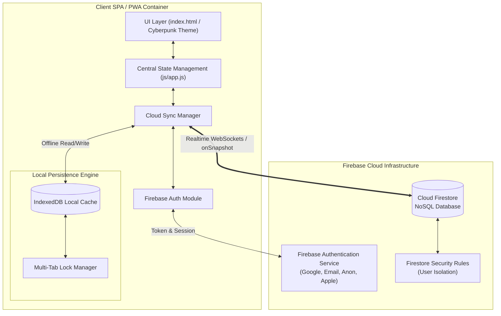
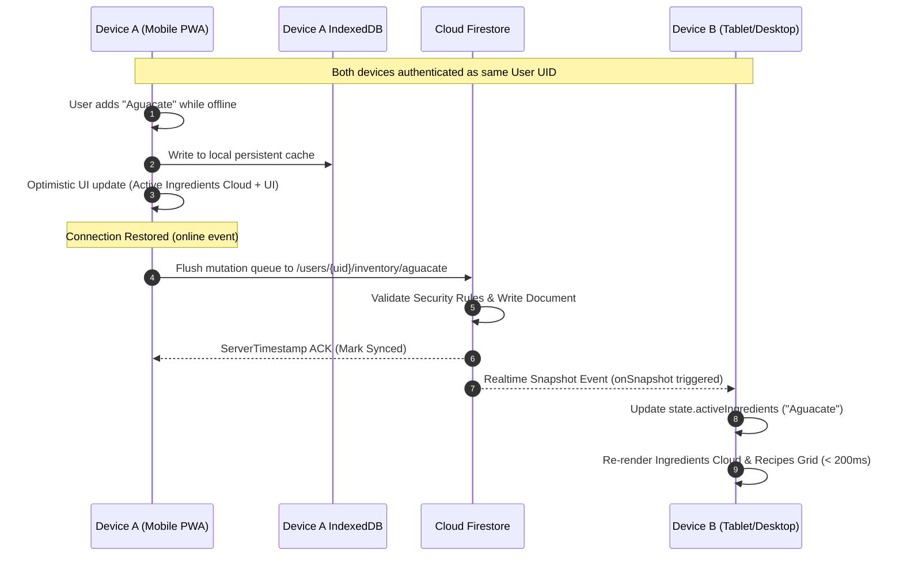
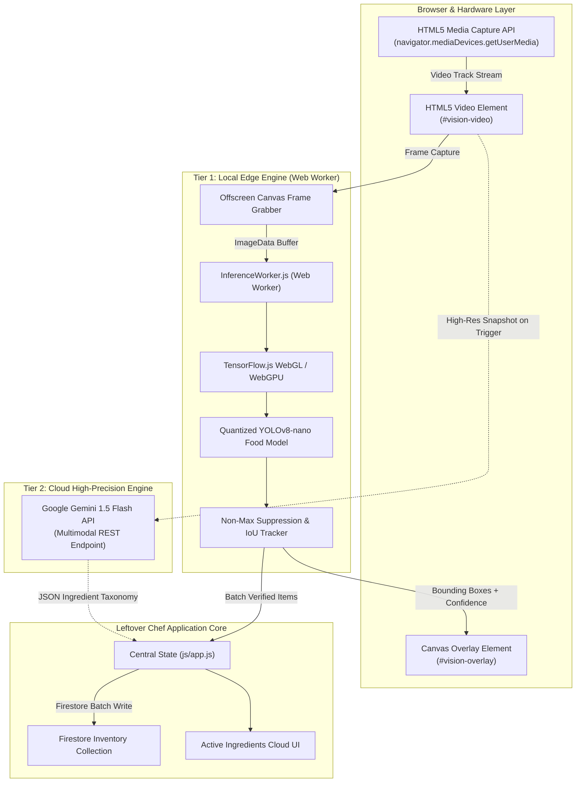
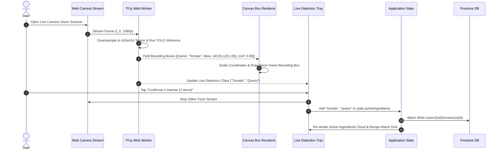

# Technical Specification: Phase 2.0 (Cloud Firebase Integration) & Phase 3.0 (Computer Vision Real-Time Image Recognition)

**Project**: Leftover Chef — Thermomix AI Assistant  
**Author**: Explorer 1 (Milestone 2 Spec Design)  
**Date**: 2026-07-27  
**Working Directory**: `c:\Users\oscar\.gemini\antigravity\scratch\Leftover-Chef\.agents\teamwork_preview_explorer_m2_1`  

---

## 1. Executive Summary

This document provides the complete, production-grade technical specification for **Phase 2.0 (Cloud Firebase Integration)** and **Phase 3.0 (Computer Vision Real-Time Image Recognition)** of the Leftover Chef roadmap.

Leftover Chef currently operates as a local-first Single Page Application (SPA) utilizing HTML5, CSS3 (Glassmorphism Cyberpunk/Cyber-Kitchen theme), Vanilla JavaScript (`js/app.js`, `js/recipes.js`, `js/scanner.js`), and `localStorage` persistence (`leftover_chef_*`). 

To transition Leftover Chef into an enterprise-grade, multi-device smart kitchen platform:
1. **Phase 2.0** introduces Cloud Firebase infrastructure providing secure multi-provider authentication, offline-first Firestore synchronization with IndexedDB persistence, sub-200ms multi-device real-time state synchronization, and deterministic conflict resolution.
2. **Phase 3.0** introduces a high-performance, real-time Computer Vision camera subsystem using HTML5 Media Capture API, WebGL/WebGPU-accelerated edge inference via TensorFlow.js in a dedicated Web Worker, real-time neon bounding box overlay rendering, and seamless fallback to Google Gemini 1.5 Flash Cloud Vision API for multi-ingredient segmentation and instant inventory commit.

---

## 2. Phase 2.0: Cloud Firebase Integration Specification

### 2.1 Firebase Authentication Architecture

Leftover Chef requires a frictionless user onboarding experience that transitions seamlessly from guest browsing to secure multi-device account synchronization.

```
+-----------------------------------------------------------------------------------+
|                            Authentication Subsystem                               |
|                                                                                   |
|  +------------------+   +-------------------+   +---------------+  +-----------+  |
|  | Anonymous Auth   |   | Google OAuth 2.0  |   | Email/Pass    |  | Apple ID  |  |
|  | (Instant Guest)  |   | (One-Tap Popup)   |   | (Passwordless)|  | (Sign-In) |  |
|  +--------+---------+   +---------+---------+   +-------+-------+  +-----+-----+  |
|           |                       |                     |                |        |
|           +-----------------------+----------+----------+----------------+        |
|                                              |                                    |
|                                   v          v                                    |
|                   +---------------------------------------+                       |
|                   |  Firebase Auth Engine (SDK v10 Modular)|                       |
|                   +-------------------+-------------------+                       |
|                                       |                                           |
|                                       v                                           |
|                 +-------------------------------------------+                     |
|                 |  Account Linking & Anonymous Migration    |                     |
|                 |  (`linkWithCredential` / Account Merge)   |                     |
|                 +-------------------------------------------+                     |
+-----------------------------------------------------------------------------------+
```

#### 2.1.1 Authentication Providers & Initialization
- **Modular Firebase SDK v10**: Imported dynamically via ES modules (`firebase/app`, `firebase/auth`).
- **Supported Identity Providers**:
  1. **Anonymous Authentication (`signInAnonymously`)**: Auto-initialized on first app launch if no active user token exists. Allows immediate use of ingredients, recipes, and local scanning without signup popups.
  2. **Google OAuth 2.0 (`GoogleAuthProvider`)**: One-click sign-in via popup (`signInWithPopup`) or redirect (`signInWithRedirect`).
  3. **Email & Password / Magic Link (`EmailAuthProvider`)**: Passwordless email link sign-in for security.
  4. **Sign in with Apple (`OAuthProvider('apple.com')`)**: Mandated for iOS PWA standalone installation compatibility.
- **Session Persistence**: Configured to `browserLocalPersistence` ensuring JWT session tokens persist across browser restarts, PWA standalone re-launches, and offline sessions.

#### 2.1.2 Anonymous Account Migration Protocol
When a guest user with active fridge inventory and meal plans decides to sign in with Google or Email:
1. Obtain target auth credential (`AuthCredential`).
2. Call `linkWithCredential(currentUser, credential)`.
3. If linking succeeds: convert the existing anonymous `uid` to the permanent account `uid`. All existing Firestore documents under `users/{anonymousUid}` remain attached to the user seamlessly.
4. If account exists (`auth/credential-already-in-use`): execute custom client merge function:
   - Read local IndexedDB/Firestore snapshot under `users/{anonymousUid}`.
   - Batch write (`writeBatch()`) local inventory, custom ingredients, and bookmarks into target `users/{existingUid}`.
   - Sign in to `users/{existingUid}` and delete temporary anonymous document.

#### 2.1.3 Multi-Profile Synchronization Integration
- Leftover Chef's existing multi-profile system (`leftover_chef_profiles`) maps directly to sub-collections under `users/{userId}/profiles/{profileId}`.
- Switching active profile updates the active snapshot listener query without re-authenticating.

---

### 2.2 Cloud Firestore Database Schema & Security Rules

#### 2.2.1 Collection & Document Data Model

```
firestore-root
│
└── users/ (collection)
    └── {userId} (document)
        ├── displayName: string
        ├── email: string
        ├── photoURL: string
        ├── thermomixModel: "TM5" | "TM6" | "TM31"
        ├── createdAt: timestamp (serverTimestamp)
        ├── lastActiveAt: timestamp (serverTimestamp)
        │
        ├── inventory/ (sub-collection)
        │   └── {ingredientId} (document)
        │       ├── name: string (e.g., "tomate")
        │       ├── category: string (e.g., "verduras")
        │       ├── quantity: number (e.g., 3)
        │       ├── unit: string (e.g., "piezas", "g", "ml")
        │       ├── addedAt: timestamp
        │       ├── source: "manual" | "vision_camera" | "preset"
        │       ├── confidenceScore: number (null if manual, 0.0 - 1.0 if vision)
        │       └── expiryDate: timestamp | null
        │
        ├── custom_ingredients/ (sub-collection)
        │   └── {customId} (document)
        │       ├── name: string
        │       ├── categoryId: string
        │       └── icon: string
        │
        ├── bookmarks/ (sub-collection)
        │   └── {recipeId} (document)
        │       ├── recipeId: string
        │       ├── bookmarkedAt: timestamp
        │       ├── personalNotes: string
        │       └── rating: number (1-5)
        │
        ├── meal_plans/ (sub-collection)
        │   └── {planId} (document)
        │       ├── generatedAt: timestamp
        │       ├── targetDays: number (e.g., 3)
        │       ├── planData: map (serialized plan structure)
        │       └── completedSteps: array of strings
        │
        └── devices/ (sub-collection)
            └── {deviceId} (document)
                ├── deviceName: string (e.g., "iPhone 15 Pro PWA")
                ├── platform: string (e.g., "iOS", "Windows", "Android")
                ├── lastSyncedAt: timestamp
                └── pushToken: string | null
```

#### 2.2.2 Firestore Security Rules (`firestore.rules`)
Strict user-isolation security rules prevent unauthorized access or cross-tenant data leakage:

```javascript
rules_version = '2';
service cloud.firestore {
  match /databases/{database}/documents {
    
    // Helper functions
    function isAuthenticated() {
      return request.auth != null;
    }
    
    function isOwner(userId) {
      return isAuthenticated() && request.auth.uid == userId;
    }

    function isValidIngredient(data) {
      return data.name is string 
          && data.name.size() > 0 
          && data.name.size() <= 100
          && (data.quantity is number && data.quantity >= 0);
    }

    // User Profile Document
    match /users/{userId} {
      allow read, write: if isOwner(userId);
      
      // Sub-collections under User
      match /inventory/{ingredientId} {
        allow read, write: if isOwner(userId) && (request.method != 'create' || isValidIngredient(request.resource.data));
      }
      
      match /custom_ingredients/{customId} {
        allow read, write: if isOwner(userId);
      }
      
      match /bookmarks/{recipeId} {
        allow read, write: if isOwner(userId);
      }

      match /meal_plans/{planId} {
        allow read, write: if isOwner(userId);
      }

      match /devices/{deviceId} {
        allow read, write: if isOwner(userId);
      }
    }
  }
}
```

---

### 2.3 Offline Persistence & Conflict Resolution Strategy

#### 2.3.1 IndexedDB Offline Persistence Setup
Firebase SDK v10 modular persistence configuration:
```javascript
import { initializeFirestore, persistentLocalCache, persistentMultipleTabManager } from 'firebase/firestore';

const db = initializeFirestore(app, {
  localCache: persistentLocalCache({
    tabManager: persistentMultipleTabManager() // Synchronizes offline changes across multiple open tabs
  })
});
```

#### 2.3.2 Offline Mutation Queue & Network Reconnection Sequence
1. **Offline Write**: When the user adds/removes an ingredient while offline, Firestore writes immediately to local IndexedDB storage.
2. **Optimistic UI Propagation**: Local snapshot listeners trigger immediately (`fromCache: true`), updating `state.activeIngredients` and refreshing the UI instantly.
3. **Pending Writes Tracking**: Mutations are stored in an internal persistent pending mutation queue.
4. **Reconnection Sync**: Upon network reconnection (`window.addEventListener('online')`), the Firebase background sync engine flushes the pending write queue to Cloud Firestore using transaction batches.

#### 2.3.3 Deterministic Conflict Resolution Engine
When multiple devices make offline edits concurrently to the same document:
- **Scalar Property Edits**: Resolved via **Last-Write-Wins (LWW)** using Firestore `serverTimestamp()`. The document version with the latest server-validated timestamp overwrites scalar values.
- **Collection & Set Mutations**: Resolved using field transform operations:
  - Adding ingredients: Uses doc write or `arrayUnion()` preventing item duplication.
  - Deleting ingredients: Uses `deleteDoc()` or `arrayRemove()`.
  - Incremental quantities: Uses `increment(delta)` for transactional quantity adjustments.

#### 2.3.4 Network & Sync Status UI Indicator Specification
A visual badge integrated into the header next to settings indicating sync health:
- **`Online & Synced`**: Green dot (`--neon-primary`), label "Sincronizado".
- **`Syncing...`**: Pulsing cyan dot (`--neon-accent`), label "Sincronizando cambios...".
- **`Offline Mode`**: Amber dot (`#f59e0b`), label "Modo Offline (Guardado local)".
- **`Sync Error`**: Rose red dot (`--neon-secondary`), label "Error de conexión".

---

### 2.4 Multi-Device Real-Time Synchronization Architecture

#### 2.4.1 Snapshot Listener Engine
```javascript
import { collection, onSnapshot, query, orderBy } from 'firebase/firestore';

class CloudSyncManager {
  constructor(userId, appState) {
    this.userId = userId;
    this.appState = appState;
    this.unsubscribeInventory = null;
  }

  subscribeInventory() {
    const q = query(
      collection(db, `users/${this.userId}/inventory`),
      orderBy('addedAt', 'desc')
    );

    this.unsubscribeInventory = onSnapshot(q, (snapshot) => {
      const updatedIngredients = new Set();
      snapshot.forEach(doc => {
        const item = doc.data();
        updatedIngredients.add(item.name.toLowerCase());
      });

      // Update central state & trigger UI re-render
      this.appState.activeIngredients = updatedIngredients;
      updateIngredientsUI();
      renderRecipes();

      const source = snapshot.metadata.fromCache ? 'IndexedDB (Cache)' : 'Cloud Firestore';
      console.log(`[SyncEngine] Updated ${updatedIngredients.size} items from ${source}`);
    }, (error) => {
      console.error('[SyncEngine] Inventory listener error:', error);
    });
  }
}
```

---

### 2.5 Phase 2.0 Mermaid Architecture & Sequence Diagrams

#### Diagram 2.1: Phase 2.0 Component Architecture


#### Diagram 2.2: Multi-Device Real-Time Synchronization & Offline Flow


---

## 3. Phase 3.0: Computer Vision Real-Time Image Recognition Specification

### 3.1 Web Camera API & Video Stream Subsystem

#### 3.1.1 HTML5 Media Capture API Configuration
```javascript
const CAMERA_CONSTRAINTS = {
  audio: false,
  video: {
    facingMode: { ideal: "environment" }, // Prefer back camera on mobile devices
    width: { ideal: 1920, min: 1280 },
    height: { ideal: 1080, min: 720 },
    frameRate: { ideal: 30, max: 30 }
  }
};
```

#### 3.1.2 Offscreen Canvas & WebGL Inference Processor
- **Streaming Pipeline**: `<video id="vision-camera-feed" autoplay playsinline muted>` captures live stream.
- **Offscreen Processing Canvas**: An `OffscreenCanvas` (320x320 or 416x416 resolution matching tensor input size) extracts raw video frames via `drawImage()` without triggering main thread DOM redraws.
- **Torch / Flash LED Control**: Uses `ImageCapture` API track capabilities:
  ```javascript
  const track = stream.getVideoTracks()[0];
  const capabilities = track.getCapabilities();
  if (capabilities.torch) {
    track.applyConstraints({ advanced: [{ torch: true }] });
  }
  ```
- **Fallback Handling**: If camera permission is denied (`NotAllowedError`) or no camera device exists (`NotFoundError`), gracefully display file upload drag-and-drop scanner card (existing `js/scanner.js` functionality).

---

### 3.2 Dual AI Model Architecture (TensorFlow.js Edge + Cloud Vision Hybrid)

Leftover Chef utilizes a high-efficiency **Dual-Tier Hybrid Vision Architecture**:

```
+-----------------------------------------------------------------------------------+
|                        Dual AI Vision Recognition Engine                          |
|                                                                                   |
|  Live Video Frame (30 fps)                                                         |
|         |                                                                         |
|         v                                                                         |
|  +-----------------------------------------------------------------------------+  |
|  | Tier 1: TensorFlow.js Edge Model (Inference Worker Thread)                   |  |
|  | - Custom YOLOv8-nano Quantized Model (tfjs_graph_model)                     |  |
|  | - Target FPS: 10-15 inferences/sec on WebGL / WebGPU acceleration           |  |
|  | - Output: Bounding Boxes + Confidence Scores (80+ Common Ingredients)       |  |
|  +-------------------------------------+---------------------------------------+  |
|                                        |                                          |
|                 +----------------------+----------------------+                   |
|                 | Confidence >= 65%                           | Confidence < 65%  |
|                 v                                             v or User Snapshot  |
|  +-------------------------------+            +--------------------------------+  |
|  | Real-Time Bounding Box Overlay|            | Tier 2: Cloud Vision API       |  |
|  | Instant Local Inventory Pill   |            | Google Gemini 1.5 Flash        |  |
|  +-------------------------------+            | - Full HD Multimodal Analysis  |  |
|                                               | - Brand & Expiry Date Parsing  |  |
|                                               +---------------+----------------+  |
|                                                               |                   |
|                                                               v                   |
|                                               +--------------------------------+  |
|                                               | Verified High-Precision Items  |  |
|                                               +--------------------------------+  |
+-----------------------------------------------------------------------------------+
```

#### 3.2.1 Tier 1: Edge Inference via TensorFlow.js (`InferenceWorker.js`)
- **Model**: Quantized YOLOv8-nano trained on COCO + custom OpenImages Food dataset (80 ingredient categories: tomato, onion, garlic, cheese, milk, chicken, egg, pepper, carrot, etc.).
- **Execution Environment**: Runs inside a dedicated **Web Worker** (`InferenceWorker.js`) using `@tensorflow/tfjs-backend-webgl` or `@tensorflow/tfjs-backend-webgpu`.
- **Latency Target**: 30-50ms per frame (15-20 FPS inference frequency).
- **Post-Processing**: Non-Maximum Suppression (NMS) with Intersection over Union (IoU) threshold = 0.45 and confidence threshold = 0.60.

#### 3.2.2 Tier 2: High-Precision Cloud Analysis (Google Gemini 1.5 Flash API)
- **Trigger Conditions**:
  1. User taps "Capturar e Inspeccionar" button.
  2. Edge model detects unknown/unclassified object clusters with confidence < 65%.
- **Payload & Endpoint**: Sends compressed JPEG base64 buffer to Google Gemini 1.5 Flash API via multimodal prompt request:
  ```json
  {
    "contents": [{
      "parts": [
        { "text": "Identifica todos los ingredientes visibles en la imagen para una receta de cocina. Devuelve un arreglo JSON con campos: name, category, quantity, confidence, boundingBox [ymin, xmin, ymax, xmax]." },
        { "inlineData": { "mimeType": "image/jpeg", "data": "<base64_string>" } }
      ]
    }]
  }
  ```

#### 3.2.3 Tier Switch Matrix
| Metric / Criteria | Tier 1 (TensorFlow.js Edge) | Tier 2 (Gemini 1.5 Flash Cloud) |
|---|---|---|
| **Latency** | 20 - 50 ms | 800 - 1500 ms |
| **Network Cost** | Zero (Offline local execution) | API Request (Requires internet) |
| **Object Classes** | 80 predefined core ingredients | Unlimited open-vocabulary recognition |
| **Brand / Text OCR** | No | Yes (Label, packaging, expiry dates) |
| **Primary Purpose** | Continuous live view preview & bounding box tracking | Final snapshot verification & high-detail segmentation |

---

### 3.3 Ingredient Segmentation & Real-Time Bounding Box Detection

#### 3.3.1 Canvas Bounding Box Renderer Overlay
A transparent `<canvas id="vision-box-overlay">` is positioned directly over the `<video>` element with matching aspect ratio and resolution coordinates.

```javascript
class BoundingBoxRenderer {
  constructor(canvasElement) {
    this.canvas = canvasElement;
    this.ctx = canvasElement.getContext('2d');
  }

  renderDetections(detections, scaleX, scaleY) {
    this.ctx.clearRect(0, 0, this.canvas.width, this.canvas.height);

    detections.forEach(det => {
      const [x, y, w, h] = det.bbox; // Model coordinates
      const canvasX = x * scaleX;
      const canvasY = y * scaleY;
      const canvasW = w * scaleX;
      const canvasH = h * scaleY;

      // Color coding based on category
      const strokeColor = this.getCategoryColor(det.category);

      // Cyber-Kitchen Bounding Box Style
      this.ctx.strokeStyle = strokeColor;
      this.ctx.lineWidth = 3;
      this.ctx.shadowColor = strokeColor;
      this.ctx.shadowBlur = 10;
      this.ctx.strokeRect(canvasX, canvasY, canvasW, canvasH);

      // Corner Accents (Cyberpunk Aesthetic)
      this.drawCornerAccents(canvasX, canvasY, canvasW, canvasH, strokeColor);

      // Label Pill
      const labelText = `${det.name} ${Math.round(det.confidence * 100)}%`;
      this.ctx.fillStyle = strokeColor;
      this.ctx.fillRect(canvasX, canvasY - 24, this.ctx.measureText(labelText).width + 16, 24);

      this.ctx.fillStyle = '#0b0f19';
      this.ctx.font = 'bold 12px Outfit, sans-serif';
      this.ctx.fillText(labelText, canvasX + 8, canvasY - 7);
    });
  }

  getCategoryColor(category) {
    switch (category) {
      case 'verduras': case 'frutas': return '#10b981'; // Emerald
      case 'lacteos': return '#0ea5e9';                 // Cyan
      case 'carnes': case 'proteinas': return '#f43f5e'; // Coral Rose
      default: return '#fbbf24';                        // Amber Accent
    }
  }
}
```

#### 3.3.2 Spatial Temporal Tracking (IoU Box Smoothing)
To eliminate bounding box flickering across live 30fps video frames:
- Calculate **Intersection over Union (IoU)** between detection centroids in frame `t` and frame `t-1`.
- Apply exponential moving average (EMA) smoothing to box coordinates:
  $$\text{Box}_t = \alpha \cdot \text{Box}_{\text{detected}} + (1 - \alpha) \cdot \text{Box}_{t-1} \quad (\alpha = 0.7)$$

---

### 3.4 Automated Inventory Insertion & UX Workflow

#### 3.4.1 Real-Time Camera Scanner UI Layout (`index.html`)

```html
<!-- REAL-TIME VISION SCANNER MODAL / VIEWPORT -->
<div class="vision-viewport-container glass">
  <!-- Live Camera Video -->
  <video id="vision-video" autoplay playsinline muted></video>
  
  <!-- Bounding Box Canvas Overlay -->
  <canvas id="vision-overlay"></canvas>

  <!-- Cyber Scanline Overlay Animation -->
  <div class="scan-beam-line"></div>

  <!-- Real-Time Live Ingredient Tray -->
  <div class="vision-live-tray" id="vision-live-tray">
    <div class="tray-header">
      <span>Ingredientes Detectados en Tiempo Real</span>
      <span class="badge status-in-progress" id="detected-count">0 items</span>
    </div>
    <div class="tray-chips" id="vision-detected-chips">
      <!-- Dynamically inserted ingredient pills -->
    </div>
  </div>

  <!-- Controls Bar -->
  <div class="vision-controls">
    <button id="btn-toggle-torch" class="icon-btn" title="Flash LED">🔦</button>
    <button id="btn-snap-confirm" class="btn btn-primary btn-lg">
      ⚡ Confirmar e Insertar (3)
    </button>
    <button id="btn-close-vision" class="icon-btn" title="Cerrar Cámara">✕</button>
  </div>
</div>
```

#### 3.4.2 Detection State Machine & User Flow
1. **State `IDLE`**: User clicks "Escanear Cámara en Vivo" in `.main-left` scanner card.
2. **State `INITIALIZING`**: Request camera permissions, spin up Web Worker `InferenceWorker.js`, attach stream to `<video>`.
3. **State `SCANNING_LIVE`**:
   - Web Worker processes video frames continuously.
   - Live bounding boxes render on `<canvas>`.
   - Detected ingredients accumulate in the live tray (`#vision-detected-chips`).
4. **State `PAUSED_VERIFICATION`**: User taps "Confirmar e Insertar" or locks frame.
   - Camera stream pauses on final high-resolution freeze frame.
   - Verification drawer opens: user can adjust quantities, uncheck false positives, or add custom tags.
5. **State `COMMIT`**:
   - Selected items batch inserted into `state.activeIngredients`.
   - If Phase 2.0 Cloud Sync is active, execute Firestore batch write to `/users/{uid}/inventory/`.
   - Toast notification: "3 ingredientes añadidos al refrigerador". Camera stream stopped.

---

### 3.5 Phase 3.0 Mermaid Architecture & Sequence Diagrams

#### Diagram 3.1: Phase 3.0 Computer Vision System Architecture


#### Diagram 3.2: Frame-by-Frame Real-Time Recognition & Inventory Commit Sequence


---

## 4. Integration Matrix with Existing Codebase

| Component / Module | Affected Files | Key Code Modifications / Additions |
|---|---|---|
| **Firebase Auth & Firestore** | `js/app.js`, `index.html` | Add Firebase v10 SDK scripts/imports, initialize `CloudSyncManager`, bind auth status to header UI. |
| **Offline Persistence & Sync UI** | `css/styles.css`, `index.html` | Add sync status indicator badge in header (`.sync-indicator-pill`), IndexedDB multi-tab lock manager. |
| **Vision Camera Viewport** | `index.html`, `js/scanner.js` | Add `#vision-viewport-container`, `<video>`, `<canvas>`, torch toggle, live ingredient chip tray. |
| **TF.js Web Worker** | `js/InferenceWorker.js` (New) | Implement Web Worker thread running TensorFlow.js WebGL model, frame downsampling, NMS bounding box calculations. |
| **Gemini Multimodal Vision API** | `js/scanner.js` | Update existing `FridgeScanner` to send high-res snapshot fallback requests to Gemini 1.5 Flash multimodal endpoint. |
| **Service Worker PWA Update** | `service-worker.js` | Bump `CACHE_NAME` to `leftover-chef-v2`, pre-cache `InferenceWorker.js` and TF.js model weights (`model.json`, `group1-shard.bin`). |

---

## 5. Technical Risk Analysis & Risk Mitigation Strategy

| Risk Factor | Severity | Mitigation Strategy |
|---|---|---|
| **Mobile GPU Overheating / Battery Drain** | High | Cap live edge inference to 10 FPS (100ms interval). Pause Web Worker inference when user is stationary or camera feed is hidden. |
| **Low-End Devices WebGL Incompatibility** | Medium | Graceful fallback to Tier 2 Gemini Cloud Vision snapshot-only mode if `tf.findBackend('webgl')` fails. |
| **Firestore Multi-Device Sync Loops** | Medium | Use `snapshot.metadata.hasPendingWrites` guard to prevent local optimistic writes from triggering redundant state loops. |
| **Offline Storage Quota Limits** | Low | IndexedDB auto-eviction policy; restrict offline meal plan binary assets; store text metadata only. |

---

## 6. Conclusion & Handoff Summary

Phase 2.0 and Phase 3.0 transform Leftover Chef into an advanced, cloud-synchronized, computer-vision powered PWA. All specified models, schema, security rules, and real-time bounding box pipelines fit cleanly within the existing HTML5 / CSS3 Cyberpunk / Vanilla JS modular framework without breaking backward compatibility.
