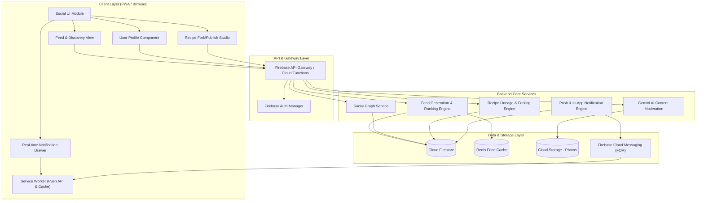
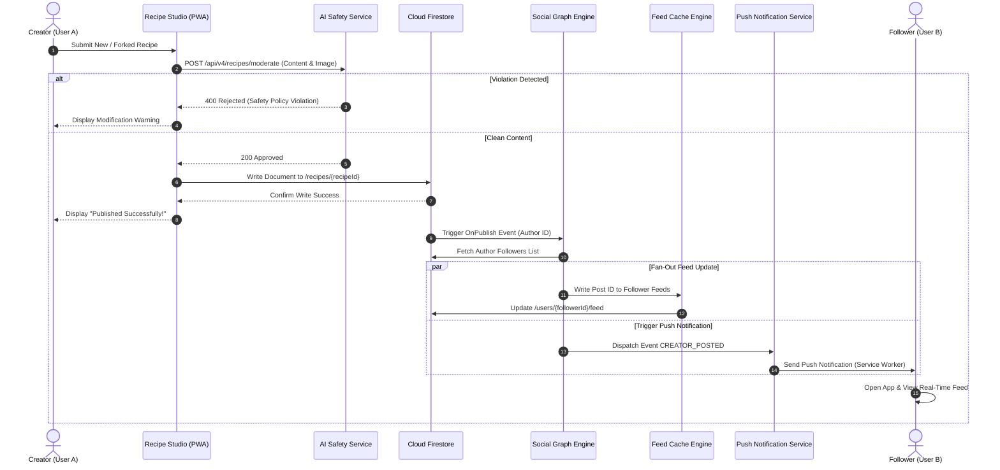
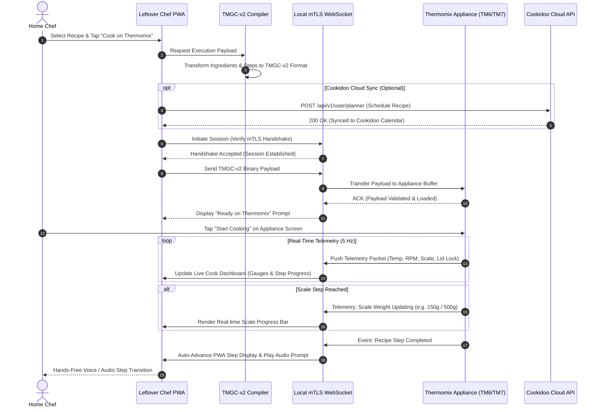

# Leftover Chef — Technical Architecture Specification
## Phase 4.0 (Recipe Social Network) & Phase 5.0 (Thermomix Cookidoo Ecosphere Synchronization)

---

## Executive Summary

This specification provides the architectural blueprint for **Phase 4.0 (Recipe Social Network)** and **Phase 5.0 (Thermomix Cookidoo Ecosphere Synchronization)** of the Leftover Chef ecosystem. Building upon the web application baseline (v1.0), Cloud Firebase storage layer (v2.0), and Computer Vision recognition engine (v3.0), these two phases expand Leftover Chef into a community-driven content platform and a direct hardware-integrated smart appliance controller.

Key architectural highlights:
1. **Phase 4.0 (Recipe Social Network)**: Establishes user identity profiles, social graph management, personalized recipe activity feeds, community publishing with recipe version control (forking/remixing), rating/review moderation pipelines, and multi-channel real-time notifications.
2. **Phase 5.0 (Thermomix Cookidoo Ecosphere Synchronization)**: Establishes IoT device connectivity (BLE, local WebSocket, MQTT over TLS) with Thermomix TM6/TM7 hardware, bi-directional synchronization with Vorwerk's Cookidoo API (OAuth2), automated compilation of recipes into machine-executable Thermomix Guided Cooking payloads (`TMGC-v2`), and real-time telemetry sensor streaming.

---

# Section 1: Phase 4.0 — Recipe Social Network Technical Specification

## 1.1 Overview & Key Capabilities

Phase 4.0 transforms Leftover Chef from a personal kitchen assistant into a community platform where home chefs can publish AI-generated or custom recipes, fork and adapt existing recipes, follow food creators, leave reviews, and receive real-time updates.

| Feature Area | Key Requirements | Architectural Approach |
|---|---|---|
| **User Profiles & Identity** | Public profile pages, bio, badges, stats (zero-waste score, remixes, followers), dietary preferences | Firestore `/users/{userId}` collection with public view projection & index optimization |
| **Community Publishing** | Draft/Publish lifecycle, versioned recipe revisions, fork/remix lineage tracking | Immutably versioned recipe documents in Firestore with parent lineage pointers (`parentRecipeId`) |
| **Recipe Feed Engine** | Multi-tab feed ("Following", "Trending", "Zero-Waste Spotlights", "For You") | Cloud Firestore query indexing combined with Redis cached feed lists and fan-out background workers |
| **Rating & Reviews** | 5-star multi-metric rating, photo evidence uploads, automated moderation | Firestore subcollections `/recipes/{id}/reviews` with Gemini Safety API automated content scanning |
| **Notifications** | Real-time in-app drawer, Web Push notifications (VAPID) | Cloud Functions event triggers -> Firebase Cloud Messaging (FCM) & WebPush API |
| **Social Graph Engine** | Follow/Unfollow, block list, followers/following counts | High-performance graph mapping in Firestore `/users/{userId}/followers` and `/following` |

---

## 1.2 User Profiles & Identity System

### Profile Data Structure
Every user possesses a public chef profile identified by a unique handle (`@handle`).

**Profile Attributes:**
- `uid`: Unique Firebase Authentication UID.
- `handle`: Unique string (3-20 chars, alphanumeric + underscores).
- `displayName`: User screen name.
- `avatarUrl`: Cloud Storage URL for profile photo.
- `bio`: Short user description (max 250 chars).
- `badges`: Array of earned achievements (e.g., `["ZERO_WASTE_CHEF", "TM6_PRO", "COMMUNITY_STAR"]`).
- `stats`:
  - `recipesCount`: Total published recipes.
  - `forksCount`: Total times user's recipes were forked.
  - `followersCount`: Total followers count.
  - `followingCount`: Total following count.
  - `co2SavedKg`: Cumulative CO₂ waste saved.
- `thermomixModel`: Primary appliance (`"TM5"`, `"TM6"`, `"TM7"`).
- `dietaryPreferences`: Array of tags (`["vegan", "gluten-free", "keto"]`).

---

## 1.3 Community Publishing & Recipe Forking / Remixing Engine

### 1.3.1 Recipe Publishing Lifecycle
```
[ Draft Recipe ] ---> [ AI Content & Safety Scan ] ---> [ Public Recipe Published ]
                              |
                              +---> (Violation Flagged) ---> [ Rejection / Revision Required ]
```

1. **Draft Phase**: User edits recipe locally or inside PWA workspace (`status: "DRAFT"`).
2. **Pre-Submission Validation**: System validates required ingredients, step instructions, and Thermomix parameters (speed, temperature, time, Varoma level).
3. **Automated Moderation**: Gemini Safety API checks images and text for inappropriate content or harmful non-edible ingredient instructions.
4. **Publishing**: Document written to `/recipes/{recipeId}` with `status: "PUBLISHED"` and timestamp `publishedAt`.

### 1.3.2 Recipe Forking (Remixing) Lineage
Leftover Chef introduces a Git-like version control mechanism for culinary recipes.

- When User B modifies User A's published recipe (e.g. adjusting spices or substituting ingredients based on leftover items), User B creates a **Fork**.
- **Lineage Metadata:**
  - `recipeId`: Unique string for the new recipe.
  - `parentRecipeId`: ID of User A's original recipe.
  - `rootRecipeId`: ID of the origin recipe in the lineage tree.
  - `forkDepth`: Integer indicating generation count.
  - `diffSummary`: Automated text diff highlighting changes (e.g., `"- Heavy Cream + Coconut Milk"`, `"Step 3 Speed: 4 -> 5"`).
  - `attribution`: Immutable attribution banner linking back to the original author.

---

## 1.4 Recipe Feed & Discovery Algorithm

### Feed Types

1. **Following Feed**: Chronological stream of recipes published by chefs the user follows.
2. **Trending / Hot Feed**: Ranked algorithm based on engagement velocity:
   $$\text{Score} = \frac{L + (3 \times F) + (5 \times R)}{(T + 2)^{1.5}}$$
   where $L = \text{Likes}$, $F = \text{Forks}$, $R = \text{Verified Reviews (4+ stars)}$, and $T = \text{Hours since publish}$.
3. **Zero-Waste Spotlights**: Highlighting recipes with high sustainability impact ($\text{CO}_2$ savings per ingredient density).
4. **For You Feed**: Personalized recommendations based on user's currently available fridge ingredients (scanned in v3.0 CV scanner) and dietary preferences.

### Feed Aggregation & Fan-Out Strategy
- **Hybrid Fan-Out Model**:
  - For creators with `< 5,000` followers: **Fan-out on Write** — Cloud Function pushes new recipe ID directly into follower inbox feed collections `/users/{followerId}/feed`.
  - For high-profile creators (`>= 5,000` followers): **Fan-out on Read** — Feed service fetches posts on-demand from the creator's post list to reduce write fan-out costs.

---

## 1.5 Rating, Reviews & Moderation Framework

### 5-Star Multi-Metric Rating System
Reviews include detailed ratings across three core dimensions:
- **Overall Rating**: 1 to 5 Stars.
- **Accuracy Score**: Precision of Thermomix times and temperatures.
- **Taste Score**: Flavor profile outcome.
- **Cooked It Badge**: Granted if user executed the recipe via Phase 5.0 Thermomix Guided Cook session.

### Review Object Schema
- `reviewId`: Unique ID.
- `recipeId`: Target recipe ID.
- `userId`: Author user ID.
- `ratings`: `{ overall: 5, accuracy: 4, taste: 5 }`.
- `commentText`: Text review (max 1000 chars).
- `photoUrls`: Optional array of user dish photo URLs in Cloud Storage.
- `cookedItVerified`: Boolean flag verified via appliance sync log.
- `createdAt`: ISO 8601 timestamp.

---

## 1.6 Real-Time Social Notifications System

### Multi-Channel Architecture
Notifications are dispatched via:
1. **In-App Real-Time Drawer**: Firestore snapshot listener on `/users/{userId}/notifications`.
2. **Web Push Notifications**: Service Worker background push handling using standard VAPID keys and FCM.

### Notification Event Types
- `EVENT_NEW_FOLLOWER`: User X followed you.
- `EVENT_RECIPE_LIKED`: User X liked your recipe Y.
- `EVENT_RECIPE_FORKED`: User X remixed your recipe Y into recipe Z.
- `EVENT_NEW_REVIEW`: User X left a 5-star review on recipe Y.
- `EVENT_CREATOR_POSTED`: Creator X (whom you follow) published a new recipe.

---

## 1.7 Social Graph Engine & Privacy Governance

### Graph Data Structure
- `/users/{userId}/followers/{followerUserId}`: Documents containing `followedAt`.
- `/users/{userId}/following/{targetUserId}`: Documents containing `followedAt`.

### Privacy & Governance Features
- **Public / Unlisted / Private Recipes**: Users control visibility per recipe.
- **User Block List**: Prevents blocked users from viewing profiles, commenting, or forking recipes.
- **Report & Flag Engine**: Community reporting for inappropriate content, trigger-rate automated hide pending review.

---

## 1.8 Phase 4.0 Component Architecture Diagram (Mermaid)



---

## 1.9 Phase 4.0 Data Flow Diagram (Mermaid)



---

# Section 2: Phase 5.0 — Thermomix Cookidoo Ecosphere Synchronization Technical Specification

## 2.1 Overview & Hardware Target Specifications

Phase 5.0 delivers direct integration between Leftover Chef and **Vorwerk Thermomix (TM6 & TM7)** appliances, alongside bi-directional synchronization with the **Cookidoo Web API**. This allows seamless execution of recipes generated from fridge leftovers directly on Thermomix hardware with guided step-by-step control.

```
[ Leftover Chef PWA ] <===(OAuth2 Sync)===> [ Cookidoo Cloud API ]
         ||
(Local IoT Bridge: BLE / WebSocket / MQTT)
         ||
         \/
[ Thermomix TM6 / TM7 Hardware ] (Sensors, Heating Element, Blade Motor, Varoma Display)
```

---

## 2.2 Appliance IoT Connection & Hardware Interface

### Connectivity Protocols

1. **Discovery & Pairing via Bluetooth Low Energy (BLE 5.0)**:
   - **Service UUID**: `0000TMX1-0000-1000-8000-00805F9B34FB`
   - **Characteristics**:
     - `CHAR_PAIRING_REQ` (Write): Transmits client certificate handshake & PIN verification code shown on Thermomix screen.
     - `CHAR_WIFI_CONFIG` (Write): Configures local network IP parameters for high-bandwidth Wi-Fi pairing.
     - `CHAR_DEVICE_INFO` (Read): Obtains serial number, firmware version, hardware revision (TM6 vs TM7), and attachment states.

2. **Local Appliance Communication (WebSocket over TLS / MQTT)**:
   - Once paired, the PWA establishes a secure local WebSocket connection (`wss://thermomix.local:8443/api/v1/cook`) or MQTT over TLS session.
   - **Mutual TLS (mTLS)** using device-specific pairing certificates guarantees hardware security and prevents unauthorized appliance manipulation.

### Device Connection State Machine
```
[ DISCONNECTED ] --(BLE Scan & Pair)--> [ PAIRING ] --(PIN Verified)--> [ CONNECTED_IDLE ]
       ^                                                                       |
       |                                                               (Payload Transfer)
       |                                                                       v
[ DISCONNECTED ] <--(Safety E-Stop / Lockout) <--(Telemetry Error)-- [ GUIDED_COOKING_RUNNING ]
```

---

## 2.3 Cookidoo API Integration & Bi-directional Synchronization

### Authentication Protocol
- **OAuth2 / OpenID Connect**: Leftover Chef integrates Cookidoo API using Authorization Code Flow with PKCE.
- **Scopes**: `planner:read`, `planner:write`, `bookmarks:read`, `bookmarks:write`, `shopping_list:write`.

### Bi-directional Sync Capabilities

| Sync Target | Sync Direction | Operational Mechanism |
|---|---|---|
| **Weekly Planner** | Bi-directional (`PWA <-> Cookidoo`) | Recipes generated from leftovers can be scheduled into the user's Cookidoo calendar (`/api/v1/user/planner/items`). |
| **Bookmarks / Favorites** | Bi-directional (`PWA <-> Cookidoo`) | Leftover Chef recipes marked as "Save" can be exported to Cookidoo custom recipes ("Mis Recetas Creadas"). |
| **Shopping List** | Unidirectional (`PWA -> Cookidoo`) | Missing ingredients for a chosen recipe are automatically appended to the user's official Cookidoo shopping list. |

---

## 2.4 Automated Guided Cooking Program Payload (`TMGC-v2`)

Leftover Chef compiles human-readable recipes into machine-executable binary/JSON payloads conforming to the **Thermomix Guided Cooking Format v2 (`TMGC-v2`)**.

### Payload Parameter Mappings

1. **Blade Motor Parameters**:
   - `speed`: Numeric range `0.0` to `10.0` (e.g. `0.5` = Spoon Stir, `4.0` = Chopping, `10.0` = Pureeing/Turbo).
   - `direction`: `"FORWARD"` (Chopping edge) or `"REVERSE"` (Blunt side, stir without cutting).
   - `mode`: `"NORMAL"`, `"PULSE"`, `"DOUGH_KNEAD"`, `"TURBO"`.

2. **Heating Parameters**:
   - `temperature`: Target degrees Celsius (`37°C` to `120°C` in 5° increments).
   - `mode`: `"OFF"`, `"HEATING"`, `"VAROMA"` (Steam generation mode).

3. **Timer Parameters**:
   - `durationSeconds`: Integer timer for step.

4. **Integrated Scale Prompts**:
   - `targetWeightGrams`: Expected weight to add.
   - `scaleTare`: Command to reset scale to `0g` before pouring.

5. **Varoma & Accessory Placement Instructions**:
   - `attachmentRequired`: Enum (`"NONE"`, `"MEASURING_CUP"`, `"BASKET"`, `"VAROMA_DISH"`, `"VAROMA_TRAY"`, `"BUTTERFLY_WHISK"`).

### JSON Payload Schema Example (`TMGC-v2`)
```json
{
  "payloadVersion": "2.0",
  "recipeId": "rec_leftover_gazpacho_992",
  "title": "Gazpacho de Tomate y Pimiento Rescatados",
  "totalSteps": 3,
  "steps": [
    {
      "stepIndex": 1,
      "instruction": "Añadir 500g de tomates maduros y 1 diente de ajo al vaso.",
      "scale": { "tare": true, "targetWeightGrams": 500, "toleranceGrams": 20 },
      "attachment": "MEASURING_CUP",
      "execution": { "speed": 0.0, "direction": "FORWARD", "temperature": 0, "durationSeconds": 0 }
    },
    {
      "stepIndex": 2,
      "instruction": "Triturar ingredientes.",
      "attachment": "MEASURING_CUP",
      "execution": { "speed": 7.0, "direction": "FORWARD", "temperature": 0, "durationSeconds": 30 }
    },
    {
      "stepIndex": 3,
      "instruction": "Cocinar salsa a fuego lento.",
      "attachment": "MEASURING_CUP",
      "execution": { "speed": 1.5, "direction": "REVERSE", "temperature": 90, "durationSeconds": 600 }
    }
  ]
}
```

---

## 2.5 Device Telemetry & Real-Time Appliance Monitoring

### Telemetry Stream Schema
While cooking, the Thermomix hardware transmits continuous WebSocket telemetry updates at 5 Hz (5 samples/sec):

```json
{
  "timestamp": 1777296000123,
  "deviceId": "TM6-EUR-8839201",
  "state": "RUNNING",
  "currentStep": 3,
  "telemetry": {
    "bowlTemperatureActual": 88.5,
    "bowlTemperatureTarget": 90.0,
    "motorSpeedActualRpm": 220,
    "motorTorqueNm": 1.4,
    "scaleLiveWeightGrams": 512,
    "lidLockEngaged": true,
    "varomaSensorSteamActive": false,
    "warnings": []
  }
}
```

### Safety & Telemetry Exception Handling
- **Lid Lock Enforcement**: Program automatically pauses (`state: "PAUSED"`) if motor speed exceeds Speed 2.0 while lid lock is disengaged.
- **Motor Overload Protection**: If `motorTorqueNm` exceeds safety thresholds (e.g. dense dough jamming blades), the engine issues an immediate emergency motor halt and alerts the PWA interface.
- **Overheat Cutoff**: Automatic heater shutdown if `bowlTemperatureActual` exceeds target safety parameters without liquid presence.

---

## 2.6 Phase 5.0 Component Architecture Diagram (Mermaid)

```mermaid
graph TB
    subgraph PWA ["Leftover Chef PWA (Client)"]
        UI5["Guided Cook UI & Telemetry Visualizer"]
        IoTManager["IoT Connection Manager"]
        Compiler["TMGC-v2 Payload Compiler"]
        SyncClient["Cookidoo OAuth & Sync Client"]
    end

    subgraph LocalBridge ["Local Connectivity Layer (Network / BLE)"]
        BLE["BLE 5.0 Interface"]
        WSLocal["Local WebSocket / mTLS Server"]
    end

    subgraph Appliance ["Thermomix Appliance Hardware (TM6 / TM7)"]
        Microcontroller["Core Appliance Controller (RTOS)"]
        BladeMotor["Blade Motor & Reverse Drive"]
        Heater["Heating Element & Temp Sensor"]
        ScaleSensor["Precision Weight Sensors (0.1g)"]
        ScreenUI["Thermomix Touch Display"]
        SafetyLock["Lid Lock & Thermal Safety Sensor"]
    end

    subgraph External ["External Cloud Platform"]
        CookidooCloud["Vorwerk Cookidoo API Gateway"]
    end

    UI5 --> IoTManager
    UI5 --> Compiler
    UI5 --> SyncClient

    Compiler --> WSLocal
    IoTManager --> BLE
    IoTManager --> WSLocal

    BLE --> Microcontroller
    WSLocal --> Microcontroller

    Microcontroller --> BladeMotor
    Microcontroller --> Heater
    Microcontroller --> ScaleSensor
    Microcontroller --> ScreenUI
    Microcontroller --> SafetyLock

    SyncClient <==="HTTPS / OAuth2"===> CookidooCloud
```

---

## 2.7 Phase 5.0 Data Flow Diagram (Mermaid)



---

# Section 3: Data Schemas & API Specifications

## 3.1 Social Network Schemas (Firestore / JSON)

### Firestore `/recipes/{recipeId}` Schema
```typescript
interface RecipeDocument {
  recipeId: string;
  authorId: string;
  authorHandle: string;
  authorDisplayName: string;
  title: string;
  description: string;
  coverImageUrl: string;
  status: 'DRAFT' | 'PUBLISHED' | 'ARCHIVED';
  
  // Lineage & Forking
  parentRecipeId: string | null;
  rootRecipeId: string | null;
  forkDepth: number;
  forksCount: number;

  // Recipe Specs
  prepTimeMinutes: number;
  cookTimeMinutes: number;
  servings: number;
  sustainability: {
    co2SavedKg: number;
    foodRescuedGrams: number;
  };
  
  ingredients: Array<{
    name: string;
    amount: number;
    unit: string;
    varomaLevel: 'VAROMA_TRAY' | 'VAROMA_DISH' | 'BASKET' | 'BOWL';
  }>;

  steps: Array<{
    stepNumber: number;
    instruction: string;
    thermomixSpeed?: number;
    thermomixTemp?: number;
    durationSeconds?: number;
  }>;

  // Engagement Metrics
  likesCount: number;
  reviewsCount: number;
  averageRating: number;
  publishedAt: string; // ISO 8601
}
```

---

## 3.2 Appliance Payload Schema (`TMGC-v2`)

```typescript
interface TMGCV2Payload {
  payloadVersion: '2.0';
  recipeId: string;
  title: string;
  totalSteps: number;
  steps: Array<{
    stepIndex: number;
    instruction: string;
    attachment: 'NONE' | 'MEASURING_CUP' | 'BASKET' | 'VAROMA_DISH' | 'VAROMA_TRAY' | 'BUTTERFLY_WHISK';
    scale?: {
      tare: boolean;
      targetWeightGrams: number;
      toleranceGrams: number;
    };
    execution?: {
      speed: number; // 0.0 to 10.0
      direction: 'FORWARD' | 'REVERSE';
      mode: 'NORMAL' | 'PULSE' | 'DOUGH_KNEAD' | 'TURBO';
      temperature: number; // 0 to 120 (0 = no heat)
      durationSeconds: number;
    };
  }>;
}
```

---

# Section 4: Implementation Roadmap & Strategic Integration

## 4.1 Dependency Chain & Evolutionary Path
```
Phase 1.0 (Vanilla PWA Baseline)
       |
       v
Phase 2.0 (Cloud Firebase Auth & Storage Sync)
       |
       v
Phase 3.0 (Computer Vision Ingredient Recognition)
       |
       +=======================+=======================+
       |                                               |
       v                                               v
Phase 4.0 (Recipe Social Network)             Phase 5.0 (Thermomix Synchronization)
- Community publishing                        - mTLS / BLE local pairing
- Recipe lineage & versioning                 - TMGC-v2 payload compiler
- Social graph & feed algorithms              - Cookidoo API synchronization
- Ratings, reviews & moderation               - 5 Hz Real-time telemetry monitoring
```

## 4.2 Security & Privacy Controls
1. **IoT Security**:
   - Appliance connections enforce **Mutual TLS (mTLS)** with unique hardware-derived certificates.
   - Local WebSockets reject plain HTTP / unauthenticated payloads to protect physical cooking equipment.
2. **Social Privacy & Content Moderation**:
   - Automated content scanning using Gemini Safety API prevents toxic text or harmful image uploads.
   - User granular privacy toggles: "Hide Profile from Public Search", "Allow Forking of My Recipes".
