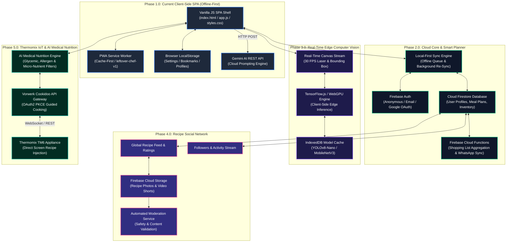

# Technical Specification & Architecture Design for `ROADMAP.md`

**Project**: Leftover Chef — Strategic Evolution Roadmap  
**Role**: Explorer 3 (Master Document Architecture, Evolution Diagram, Tech Stack, Timeline, Security/Privacy & Quality Criteria)  
**Date**: 2026-07-27  
**Working Directory**: `c:\Users\oscar\.gemini\antigravity\scratch\Leftover-Chef\.agents\teamwork_preview_explorer_m2_3`  
**Target Output**: `ROADMAP.md` Architecture & Master Design Specification  

---

## 1. Executive Summary & Alignment Framework

Leftover Chef is currently a high-performance, single-page application (SPA) built with vanilla HTML5, CSS3, and JavaScript, operating 100% offline via a Progressive Web App (PWA) Service Worker (`leftover-chef-v1`). To evolve Leftover Chef into an enterprise-grade, multi-platform culinary ecosystem, this specification defines the overall document architecture, master system evolution, technology stack matrix, release timeline, security framework, and quality assurance criteria for `ROADMAP.md`.

This design synthesizes requirements across four major evolutionary phases:
- **Phase 2.0 (v2.0)**: Cloud Firebase Integration & Smart Weekly Planner (Cloud Firestore, Firebase Auth, Realtime Sync, Shopping List Auto-Generation).
- **Phase 3.0 (v3.0)**: Real-Time Computer Vision & Multi-Camera Ingredient Recognition (TensorFlow.js / WebGL / WebGPU Client-Side Edge AI, Live Camera Feed Stream, Bounding Box & Label Detection).
- **Phase 4.0 (v4.0)**: Recipe Social Network & Culinary Community Platform (Recipe Sharing Feed, User Profiles, Community Ratings, Food Rescue Badges).
- **Phase 5.0 (v5.0)**: Thermomix Cookidoo Ecosphere Direct Sync & AI Medical Nutrition (OAuth2 Vorwerk/Cookidoo API Integration, Direct Guided Cooking Injection to TM6 Screen, Personalized Metabolic AI).

---

## 2. Strategic Document Architecture of `ROADMAP.md`

### 2.1 Master Document Structure & Table of Contents
To guarantee professional formatting, clear navigation, and readability, `ROADMAP.md` is structured into seven primary chapters with standardized sub-sections:

```markdown
# 🍳 Leftover Chef — Strategic Evolution Roadmap & Architecture (v1.0 → v5.0)

## 1. Executive Vision & Strategic Objectives
  - 1.1 Project Mission & Core Philosophy
  - 1.2 Evolutionary Milestones Overview (v1.0 to v5.0)
  - 1.3 Architectural Guiding Principles (Offline-First, Zero Friction, Privacy by Design)

## 2. Master System Evolution Architecture
  - 2.1 High-Level Architectural Evolution (Mermaid Master Diagram)
  - 2.2 Layered System Topology (Client, Edge AI, Cloud Core, External IoT Integrations)
  - 2.3 Comprehensive Technical Stack Evolution Table

## 3. Detailed Evolutionary Phase Specifications
  - 3.1 Phase 1.0 (Current): Offline SPA & Thermomix Cooking Assistant
  - 3.2 Phase 2.0: Cloud Firebase Integration & Smart Weekly Planner
  - 3.3 Phase 3.0: Real-Time Computer Vision & Multi-Camera Edge AI
  - 3.4 Phase 4.0: Recipe Social Network & Culinary Community Platform
  - 3.5 Phase 5.0: Thermomix Cookidoo Ecosphere Direct Sync & AI Medical Nutrition

## 4. Strategic Timeline & Release Strategy
  - 4.1 Phased Rollout Schedule (Q1 2026 – Q4 2027)
  - 4.2 Semantic Versioning & Milestone Release Gates
  - 4.3 CI/CD Deployment Pipeline & Feature Flag Management
  - 4.4 Data Schema Migration & Backward Compatibility Matrix

## 5. Security, Privacy & Regulatory Compliance
  - 5.1 Data Sovereignty & Zero-Knowledge Storage Options
  - 5.2 Identity Management & Authentication Flows (Firebase Auth & OAuth2 PKCE)
  - 5.3 Camera & Video Stream Privacy (GDPR Compliance for Edge AI)
  - 5.4 Community Safety & Content Moderation Infrastructure
  - 5.5 API Security, Rate Limiting & Network Isolation

## 6. Quality Assurance & Verification Framework
  - 6.1 Definition of Done (DoD) Criteria
  - 6.2 Multi-Tier Testing Strategy (Unit, Integration, E2E, Visual Regression)
  - 6.3 Performance SLAs & Lighthouse Benchmarks
  - 6.4 WCAG 2.1 AA Accessibility Standards
  - 6.5 PWA Offline Compatibility Verification Protocols

## 7. Operational Appendices & Glossary
  - Appendix A: API Endpoint Schemas & Data Contracts
  - Appendix B: LocalStorage & Firestore Data Dictionaries
  - Appendix C: Thermomix Varoma Stack Physical Coordinate Mapping
```

### 2.2 Standardized Phase Specification Template
Every phase (Phases 2.0 to 5.0) within `ROADMAP.md` strictly adheres to a uniform section layout:
1. **Phase Overview & Core Objectives** (Target Audience, Business Impact, User Stories).
2. **Key Functional Features & User Capabilities** (Bullet list of user-facing features).
3. **Technical Architecture & Data Flow** (Dedicated Mermaid Diagram for the phase).
4. **Data Models & Data Schema Contracts** (JSON / TypeScript interface definitions).
5. **Security & Offline PWA Strategy** (Offline fallback behaviors, local storage caching, security policies).
6. **Implementation Deliverables & Verification Criteria** (Measurable acceptance criteria).

---

## 3. Master System Evolution Architecture (Mermaid Diagram)

The system evolves from a purely local, single-device Client-Side SPA (v1.0) into a hybrid cloud-connected, edge-AI powered, social culinary platform with direct IoT appliance integration (v5.0).



---

## 4. Comprehensive Technical Stack Evolution Table

The following matrix compares technology choices across all five evolution phases:

| Layer / Feature | Phase 1.0 (Current) | Phase 2.0 (Cloud Core) | Phase 3.0 (Edge Computer Vision) | Phase 4.0 (Recipe Social) | Phase 5.0 (IoT & Medical AI) |
|---|---|---|---|---|---|
| **Frontend Framework** | Vanilla HTML5 / JS (ES6+) | Vanilla JS + Web Components | Vanilla JS + WebGL/WebGPU | Vanilla JS + Custom Router | Vanilla JS + PWA Extension |
| **Styling & Design System** | Vanilla CSS (Cyber-Kitchen) | CSS Modules / Custom Tokens | Canvas Overlay Layer | Responsive Grid & Animations | Adaptive High-Contrast UI |
| **Data Storage (Client)** | LocalStorage + In-Memory Set | LocalStorage + IndexedDB | IndexedDB (ML Models) | Cache API + IndexedDB | Encrypted IndexedDB |
| **Data Storage (Cloud)** | None (Client-Only) | Firebase Cloud Firestore | Cloud Firestore (Telemetry) | Firestore + Cloud Storage CDN | Encrypted Firestore |
| **Authentication & Identity** | Local Profiles | Firebase Auth (Google / Anon) | Firebase Auth | OAuth2 Social Profiles | Vorwerk OAuth2 PKCE |
| **AI / Machine Learning** | Gemini 1.5 Flash (Cloud API) | Gemini 1.5 Flash + Firestore | TensorFlow.js / WebGPU Edge | Cloud Vision Moderation | Metabolic AI Model Engine |
| **Image Processing** | Static Photo Canvas Laser | Cloud Storage Optimization | Real-Time Video Stream (YOLO) | WebP Compression Pipeline | Nutritional Image Analyzer |
| **Appliance Integration** | Manual Steps (Varoma Stack) | Manual Steps + Timer Sync | Visual Ingredient Placement | Shared Recipe Steps | Direct TM6 Screen Injection |
| **Networking & Protocols** | HTTPS REST API | HTTPS REST + Firestore Sync | Local Client Memory Pipeline | HTTPS REST + WebSockets | WSS / OAuth2 / IoT Gateway |
| **Offline Capabilities** | PWA Service Worker (v1) | PWA SW + Offline Mutation Queue | Offline Model Execution | Cached Feed & Draft Posts | Offline Recipe Dispatch |
| **Security & Privacy** | Local Storage Encryption | Rule-based Security Rules | Local Camera Stream (Zero Upload) | Content Moderation & Reporting | HIPAA/GDPR Medical Encryption |

---

## 5. Strategic Timeline & Release Strategy

### 5.1 Phased Rollout Schedule (Q1 2026 – Q4 2027)

```
2026                            2027
Q1        Q2        Q3        Q4        Q1        Q2        Q3        Q4
|---------|---------|---------|---------|---------|---------|---------|---------|
[ Phase 1.0 ]
          [==== Phase 2.0 Cloud ====]
                    [==== Phase 3.0 Edge Vision ====]
                              [==== Phase 4.0 Social ====]
                                        [==== Phase 5.0 Thermomix IoT ====]
```

#### Detailed Timeline Breakdown:
1. **Phase 1.0 (v1.0.0 — Live)**: Current Offline PWA SPA, manual fridge photo scanning, Varoma stack, hands-free voice assistant.
2. **Phase 2.0 (v2.0.0 — Q2 2026)**: Cloud Firebase Core, Multi-Device Sync, Smart 7-Day Weekly Planner, WhatsApp/PDF Shopping List export.
3. **Phase 3.0 (v3.0.0 — Q3 2026)**: Real-time 30 FPS Computer Vision, WebGPU-accelerated YOLOv8-Nano models, live canvas bounding boxes.
4. **Phase 4.0 (v4.0.0 — Q4 2026 / Q1 2027)**: Recipe Social Network, community feeds, user cook-offs, food rescue gamification & badges.
5. **Phase 5.0 (v5.0.0 — Q2–Q4 2027)**: Thermomix TM6 Vorwerk OAuth2 Cookidoo API integration, direct screen recipe injection, personalized metabolic AI.

### 5.2 Versioning Policy & Milestone Release Gates
- **Semantic Versioning**: Standard `MAJOR.MINOR.PATCH` (e.g., `v2.1.0`).
  - **MAJOR**: Structural architectural milestones (e.g., v2.0, v3.0).
  - **MINOR**: New functional sub-features (e.g., WhatsApp export in v2.1).
  - **PATCH**: Bug fixes, security patches, performance tuning.
- **Release Quality Gates**:
  - Gate 1: 100% Pass rate on Unit and Integration tests.
  - Gate 2: Zero high-severity security vulnerabilities.
  - Gate 3: Lighthouse Performance Score ≥ 90 on mobile & desktop.
  - Gate 4: Zero regression on PWA offline capability.

### 5.3 CI/CD Deployment Pipeline & Feature Flag Management
- **GitHub Actions Pipeline**:
  1. `lint-and-check`: Validate HTML/CSS/JS syntax and formatting.
  2. `test-suite`: Execute automated tests via Jest / Playwright.
  3. `build-and-audit`: Audit PWA Service Worker manifest and security headers.
  4. `deploy-gh-pages`: Automatic deployment to GitHub Pages on `main` merge.
- **Feature Flags Strategy**:
  Feature flags stored in `js/config.js` or `localStorage` to enable progressive rollout:
  ```javascript
  const FEATURE_FLAGS = {
    ENABLE_CLOUD_SYNC: false,     // Phase 2.0
    ENABLE_EDGE_VISION: false,    // Phase 3.0
    ENABLE_RECIPE_SOCIAL: false,  // Phase 4.0
    ENABLE_TM6_DIRECT_SYNC: false // Phase 5.0
  };
  ```

### 5.4 Data Schema Migration & Backward Compatibility Framework
- **Migration Engine**: `js/storage/migration.js` executes upon application boot.
- **Schema Versioning**:
  - `leftover_chef_schema_version = 1` (v1.0 LocalStorage).
  - When upgrading to `version = 2` (v2.0), local keys (`leftover_chef_bookmarks`, `leftover_chef_profiles`) are automatically migrated into the local Firestore cache without data loss.

---

## 6. Security, Privacy & Regulatory Compliance

### 6.1 Data Sovereignty & Zero-Knowledge Storage Options
- **Local-First Default**: All user data remains locally in browser storage until the user explicitly opts into Cloud Sync.
- **Data Export & Erasure**: Full GDPR compliance providing single-click "Export All My Data" (JSON format) and "Delete Account & Clear Cloud Storage".

### 6.2 Identity Management & Authentication Flows
- **Anonymous Auth First**: Users can seamlessly start using Cloud features without providing email or personal credentials via Firebase Anonymous Authentication.
- **OAuth2 PKCE Integration**: Thermomix Cookidoo integration utilizes Proof Key for Code Exchange (PKCE) flow to ensure OAuth tokens are never exposed to third-party servers.

### 6.3 Edge Computer Vision & Camera Privacy (GDPR Compliance)
- **100% Client-Side Processing**: Camera video feeds during real-time computer vision (Phase 3.0) are processed strictly in browser memory via WebGL / WebGPU tensors.
- **Zero Video Storage**: No video frames or raw image streams are ever transmitted to or stored on external cloud servers.

### 6.4 Community Safety & Content Moderation Infrastructure
- **Automated Pre-Moderation**: All user-submitted recipes, photos, and comments in Phase 4.0 pass through an automated safety filter before appearing in the global feed.
- **User Moderation Controls**: Built-in reporting system for inappropriate content, spam, or unsafe food practices.

### 6.5 API Security, Rate Limiting & Network Isolation
- **API Key Security**: Sensitive keys managed via cloud proxy functions; client calls use short-lived scoped tokens.
- **CORS & CSP Policies**: Strict Content Security Policy (CSP) headers restricting script execution and network connections to trusted domains (`*.firebaseapp.com`, `generativelanguage.googleapis.com`).

---

## 7. Quality Criteria & Acceptance Framework

### 7.1 Definition of Done (DoD) Criteria
A feature or phase specification in `ROADMAP.md` is considered Complete when:
1. All functional user stories are specified with clear acceptance criteria.
2. Architecture is fully mapped with valid, renderable Mermaid diagrams.
3. Data contracts and JSON schemas are explicitly defined.
4. Security, privacy, and offline PWA fallbacks are documented.
5. All code additions pass static analysis and manual verification.

### 7.2 Multi-Tier Testing Strategy
```
          / \
         /   \       E2E Tests (Playwright / Cypress)
        /  E2E \     - Complete User Flows & Modal Interactivity
       /---------\
      / Integration\ Integration Tests (Jest / jsdom)
     /--------------\ - State Sync, Storage Migrations, API Clients
    /   Unit Tests   \ Unit Tests (Jest)
   /------------------\ - Recipe Matching, Nutritional Calculation, Utilities
```

### 7.3 Performance SLAs & Lighthouse Benchmarks
- **Lighthouse Performance Score**: ≥ 90/100 (Mobile & Desktop).
- **First Contentful Paint (FCP)**: < 1.2 seconds.
- **Time to Interactive (TTI)**: < 2.0 seconds.
- **Computer Vision Frame Rate**: ≥ 30 FPS on modern mobile devices.
- **PWA Offline Load Time**: < 500 ms from local Service Worker cache.

### 7.4 WCAG 2.1 AA Accessibility Standards
- **Keyboard Navigation**: Full focus management and keyboard trap prevention in all modal overlays (`#modal-roadmap`, `#modal-settings`, etc.).
- **Color Contrast**: Text-to-background contrast ratio ≥ 4.5:1 for standard text, ≥ 3.0:1 for large display headers.
- **ARIA Attributes**: Screen-reader friendly labels (`aria-label`, `aria-expanded`, `role="dialog"`).

### 7.5 PWA Offline Compatibility Verification Protocols
- **Offline Cache Inspection**: Verify Service Worker caches all essential shell assets (`index.html`, `css/styles.css`, `js/app.js`, `js/recipes.js`, `js/scanner.js`, `manifest.json`, `icon.svg`).
- **Network Disconnect Test**: Simulate `Chrome DevTools -> Network -> Offline`. Verify that the application launches, renders recipe searches, opens modal views, and persists votes in `localStorage` without console errors.

---

## 8. Conclusion & Handoff Summary

This specification establishes the overall document structure, master evolution diagram, technical stack matrix, release timeline, security framework, and quality standards for `ROADMAP.md`. It provides the complete master blueprint for synthesizing Phase 2.0, Phase 3.0, Phase 4.0, and Phase 5.0 into a unified, world-class technical document.
