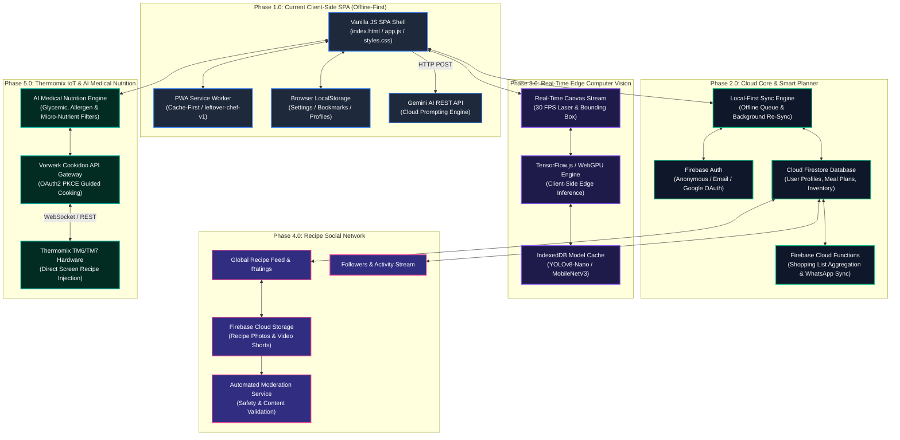
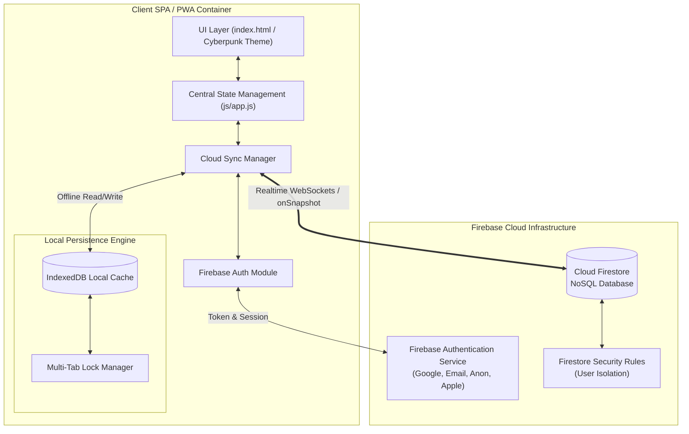
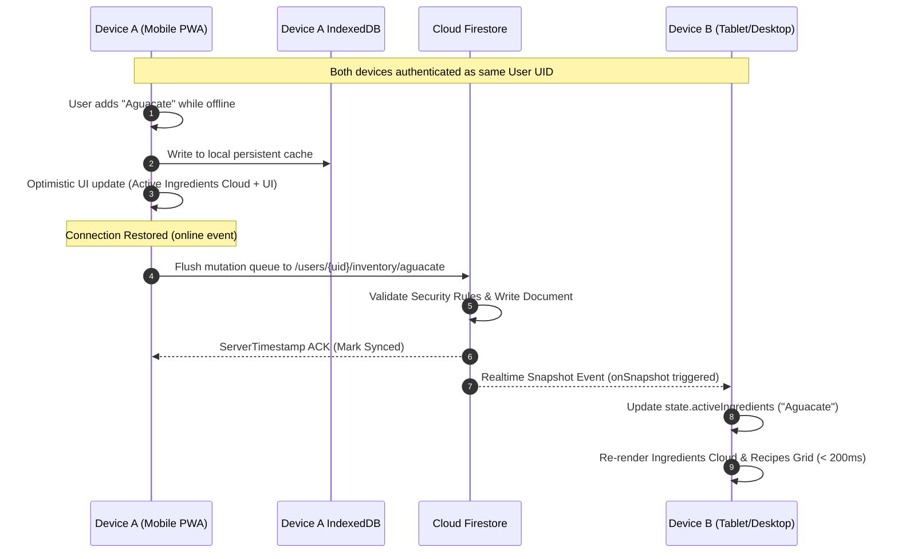
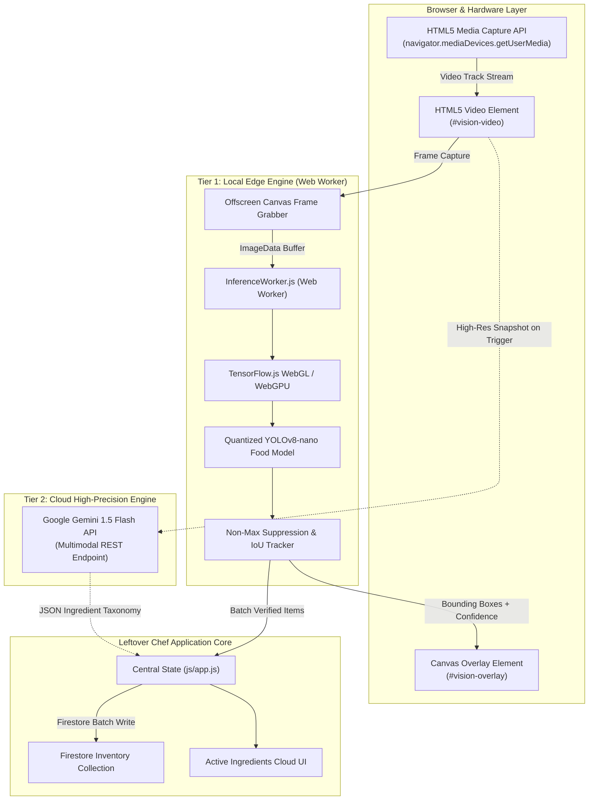
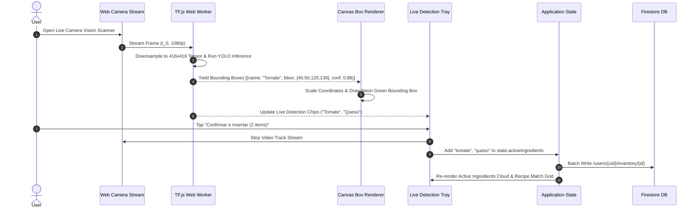
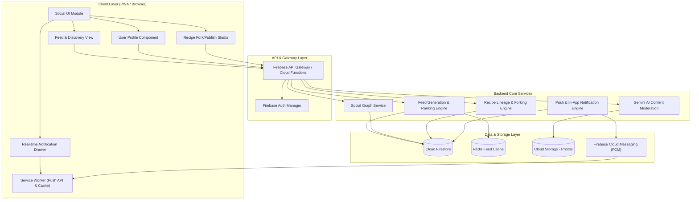
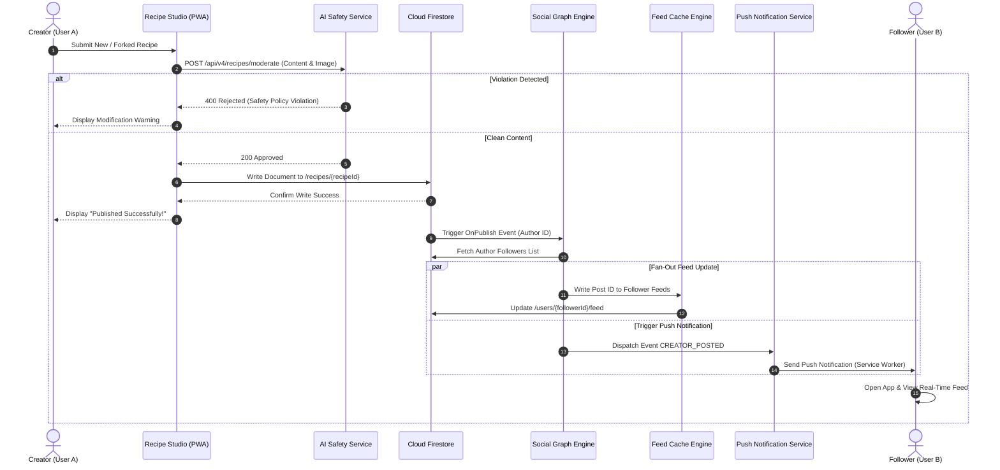
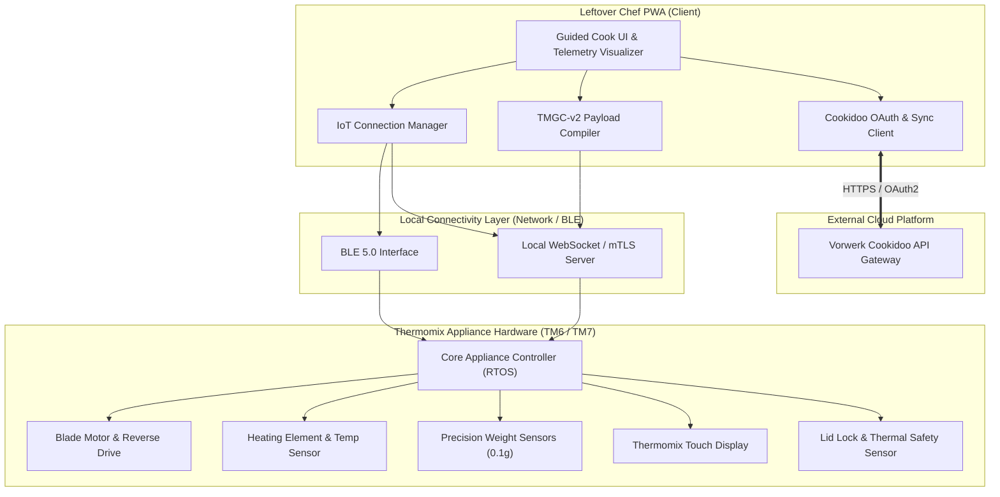
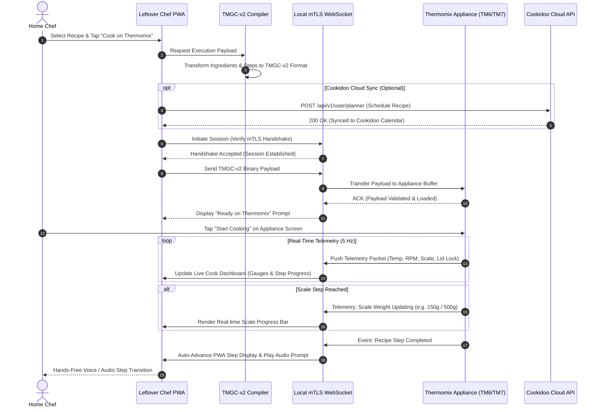

# 🍳 Leftover Chef — Strategic Evolution Roadmap & Architecture (v1.0 → v5.0)

**Project**: Leftover Chef — Thermomix AI Assistant & Smart Kitchen Platform  
**Document Version**: 2.0.0-Master  
**Target Release Spectrum**: v1.0.0 (Baseline) → v5.0.0 (Enterprise IoT Ecosystem)  
**Status**: Approved Master Architectural Specification  

---

## Table of Contents
1. [Executive Vision & Strategic Objectives](#1-executive-vision--strategic-objectives)
   - [1.1 Project Mission & Core Philosophy](#11-project-mission--core-philosophy)
   - [1.2 Evolutionary Milestones Overview (v1.0 to v5.0)](#12-evolutionary-milestones-overview-v10-to-v50)
   - [1.3 Architectural Guiding Principles](#13-architectural-guiding-principles)
2. [Master System Evolution Architecture](#2-master-system-evolution-architecture)
   - [2.1 High-Level Architectural Evolution (Mermaid Master Diagram)](#21-high-level-architectural-evolution)
   - [2.2 Layered System Topology](#22-layered-system-topology)
   - [2.3 Comprehensive Technical Stack Evolution Table](#23-comprehensive-technical-stack-evolution-table)
3. [Detailed Evolutionary Phase Specifications](#3-detailed-evolutionary-phase-specifications)
   - [3.1 Phase 1.0 (Current Baseline): Offline SPA & Thermomix Assistant](#31-phase-10-current-baseline-offline-spa--thermomix-assistant)
   - [3.2 Phase 2.0: Cloud Firebase Integration & Smart Weekly Planner](#32-phase-20-cloud-firebase-integration--smart-weekly-planner)
   - [3.3 Phase 3.0: Real-Time Computer Vision & Multi-Camera Edge AI](#33-phase-30-real-time-computer-vision--multi-camera-edge-ai)
   - [3.4 Phase 4.0: Recipe Social Network & Culinary Community Platform](#34-phase-40-recipe-social-network--culinary-community-platform)
   - [3.5 Phase 5.0: Thermomix Cookidoo Ecosphere Direct Sync & AI Medical Nutrition](#35-phase-50-thermomix-cookidoo-ecosphere-direct-sync--ai-medical-nutrition)
4. [Strategic Timeline & Release Strategy](#4-strategic-timeline--release-strategy)
   - [4.1 Phased Rollout Schedule (Q1 2026 – Q4 2027)](#41-phased-rollout-schedule-q1-2026--q4-2027)
   - [4.2 Semantic Versioning & Milestone Release Gates](#42-semantic-versioning--milestone-release-gates)
   - [4.3 CI/CD Deployment Pipeline & Feature Flag Management](#43-cicd-deployment-pipeline--feature-flag-management)
   - [4.4 Data Schema Migration & Backward Compatibility Framework](#44-data-schema-migration--backward-compatibility-framework)
5. [Security, Privacy & Regulatory Compliance](#5-security-privacy--regulatory-compliance)
   - [5.1 Data Sovereignty & Zero-Knowledge Storage Options](#51-data-sovereignty--zero-knowledge-storage-options)
   - [5.2 Identity Management & Authentication Flows](#52-identity-management--authentication-flows)
   - [5.3 Camera & Video Stream Privacy (GDPR Compliance for Edge AI)](#53-camera--video-stream-privacy-gdpr-compliance-for-edge-ai)
   - [5.4 Community Safety & Content Moderation Infrastructure](#54-community-safety--content-moderation-infrastructure)
   - [5.5 API Security, Rate Limiting & Network Isolation](#55-api-security-rate-limiting--network-isolation)
6. [Quality Assurance & Verification Framework](#6-quality-assurance--verification-framework)
   - [6.1 Definition of Done (DoD) Criteria](#61-definition-of-done-dod-criteria)
   - [6.2 Multi-Tier Testing Strategy](#62-multi-tier-testing-strategy)
   - [6.3 Performance SLAs & Lighthouse Benchmarks](#63-performance-slas--lighthouse-benchmarks)
   - [6.4 WCAG 2.1 AA Accessibility Standards](#64-wcag-21-aa-accessibility-standards)
   - [6.5 PWA Offline Compatibility Verification Protocols](#65-pwa-offline-compatibility-verification-protocols)
7. [Operational Appendices & Technical Schemas](#7-operational-appendices--technical-schemas)
   - [Appendix A: Complete Firestore Security Rules (`firestore.rules`)](#appendix-a-complete-firestore-security-rules-firestorerules)
   - [Appendix B: Data Schemas & API Specifications](#appendix-b-data-schemas--api-specifications)
   - [Appendix C: Codebase Integration Matrix](#appendix-c-codebase-integration-matrix)

---

## 1. Executive Vision & Strategic Objectives

### 1.1 Project Mission & Core Philosophy
Leftover Chef addresses two critical global culinary challenges: **food waste reduction** and **smart home kitchen automation**. By transforming available fridge leftovers into gourmet Thermomix recipes, Leftover Chef empowers home cooks to eliminate household food waste, minimize grocery expenditure, and maximize the utility of advanced kitchen appliances.

The platform operates under a core philosophy:
- **Zero Friction**: Immediate access without mandatory login walls or lengthy registration.
- **Zero Waste**: Intelligent recipe matching algorithm that maximizes utilization of expiring ingredients.
- **Offline-First Resilience**: Reliable execution inside kitchens regardless of unstable internet access.
- **Hardware Synergy**: Native integration with Thermomix TM5, TM6, and TM7 cooking equipment.

### 1.2 Evolutionary Milestones Overview (v1.0 to v5.0)

| Phase | Title | Core Focus | Target Release |
|---|---|---|---|
| **Phase 1.0** | Offline SPA & Assistant | Local PWA baseline, photo fridge scanner, manual ingredient management, basic Thermomix step parsing. | **v1.0.0 (Live)** |
| **Phase 2.0** | Cloud Firebase Integration | Multi-provider authentication, multi-device real-time sync, offline-first Firestore persistence, smart 7-day meal planner. | **v2.0.0 (Q2 2026)** |
| **Phase 3.0** | Real-Time Computer Vision | Client-side TensorFlow.js WebGPU edge detection, live 30 FPS bounding box overlay, Gemini 1.5 Flash cloud fallback. | **v3.0.0 (Q3 2026)** |
| **Phase 4.0** | Recipe Social Network | Creator profiles, community publishing, Git-like recipe forking/remixing, engagement feeds, automated safety moderation. | **v4.0.0 (Q1 2027)** |
| **Phase 5.0** | Thermomix Cookidoo IoT Sync | Direct BLE/mTLS Thermomix hardware pairing, TMGC-v2 guided cooking compilation, Cookidoo OAuth2 sync, 5Hz telemetry stream. | **v5.0.0 (Q3 2027)** |

### 1.3 Architectural Guiding Principles
1. **Local-First, Cloud-Enhanced**: The application must remain fully functional offline using local browser storage (IndexedDB / LocalStorage) and PWA Service Worker caching. Cloud services enhance—rather than block—core user workflows.
2. **Minimal Latency & Edge Inference**: On-device AI (TensorFlow.js / WebGL / WebGPU) is prioritized for high-frequency video frame analysis, ensuring sub-50ms latency and privacy preservation.
3. **Deterministic Conflict Resolution**: Multi-device synchronization resolves offline concurrent edits gracefully using scalar Last-Write-Wins (LWW) with server timestamps and transactional field increments.
4. **Hardware Safety First**: Physical appliance control commands enforce strict thermal limits, blade motor torque protections, and mandatory lid-lock telemetry verification.

---

## 2. Master System Evolution Architecture

### 2.1 High-Level Architectural Evolution

The diagram below illustrates the complete systemic evolution of Leftover Chef from a single-device offline PWA (v1.0) to an enterprise-grade cloud, computer vision, social, and IoT appliance ecosystem (v5.0):



### 2.2 Layered System Topology

```
+-----------------------------------------------------------------------------------+
| 1. Presentation & UI Layer (HTML5, CSS3 Glassmorphism, Cyberpunk / Cyber-Kitchen) |
|    - Responsive Modal Viewports, Live Video Canvas Overlay, Dynamic Ingredient Chips|
+-----------------------------------------------------------------------------------+
| 2. Client Application Core (Vanilla JS ES6 Modular Engine)                        |
|    - app.js (State), scanner.js (Vision & Capture), recipes.js (Thermomix Matcher) |
+-----------------------------------------------------------------------------------+
| 3. Local Persistence & Edge AI Tier                                               |
|    - IndexedDB (Firestore Cache & Quantized YOLOv8 Models), Web Worker Threads   |
+-----------------------------------------------------------------------------------+
| 4. Cloud Services & Sync Gateway Tier                                             |
|    - Firebase Auth, Firestore NoSQL, Cloud Functions, Cloud Storage CDN, FCM Push |
+-----------------------------------------------------------------------------------+
| 5. External Integrations & Appliance Hardware Tier                                |
|    - Google Gemini 1.5 Flash API, Vorwerk Cookidoo API (OAuth2), Thermomix TM6/TM7|
+-----------------------------------------------------------------------------------+
```

### 2.3 Comprehensive Technical Stack Evolution Table

| Layer / Feature | Phase 1.0 (Current) | Phase 2.0 (Cloud Core) | Phase 3.0 (Edge Vision) | Phase 4.0 (Recipe Social) | Phase 5.0 (IoT & Medical AI) |
|---|---|---|---|---|---|
| **Frontend Shell** | Vanilla HTML5 / ES6 Modules | Vanilla JS + Web Components | Vanilla JS + OffscreenCanvas | Vanilla JS + Router Engine | Vanilla JS PWA Extension |
| **Styling & Theme** | CSS3 Cyberpunk Glassmorphism | CSS Custom Tokens | Canvas Bounding Layer | Responsive Feed Layouts | High-Contrast Kitchen UI |
| **Local Storage** | LocalStorage + In-Memory Set | LocalStorage + IndexedDB | IndexedDB (YOLO Weights) | Cache API + IndexedDB | Encrypted IndexedDB |
| **Cloud Storage** | None (Client-Only) | Firebase Cloud Firestore | Cloud Firestore (Telemetry) | Firestore + Cloud Storage CDN | Encrypted Firestore |
| **Authentication** | Local User Profiles | Firebase Auth (Anon/Google/Email) | Firebase Auth | OAuth2 Social Profiles | Vorwerk OAuth2 PKCE |
| **AI Processing** | Gemini 1.5 Flash Cloud | Gemini 1.5 Flash + Firestore | TensorFlow.js WebGL/WebGPU | Cloud Vision Moderation | Metabolic AI Engine |
| **Vision Input** | Static Canvas Photo Scanner | Cloud Storage Uploads | Real-Time Video Camera Stream | WebP Image Compression | Nutritional Image Analyzer |
| **Appliance Control**| Manual Step Guidance | Manual Steps + Timer Sync | Visual Placement Overlay | Shared Community Recipes | Direct TM6 Screen Injection |
| **Networking** | HTTPS REST API | HTTPS REST + Firestore Sync | Local Worker Memory Pipeline | HTTPS REST + WebSockets | WSS / OAuth2 / mTLS Gateway |
| **Offline Protocol**| Service Worker `leftover-chef-v1`| SW + Offline Mutation Queue | Offline Model Execution | Cached Feed & Draft Posts | Offline Recipe Dispatch |
| **Security/Privacy**| Local Data Isolation | User Rules Security Rules | Local Stream Processing | Content Safety & Moderation | HIPAA/GDPR Encryption |

---

## 3. Detailed Evolutionary Phase Specifications

### 3.1 Phase 1.0 (Current Baseline): Offline SPA & Thermomix Assistant
Phase 1.0 represents the active production baseline of Leftover Chef. It runs as a zero-dependency, local-first Single Page Application (SPA) backed by Service Worker `leftover-chef-v1`. Key features include:
- Interactive ingredient chip selector with categories (vegetables, proteins, dairy, spices).
- Photo scanner card supporting drag-and-drop fridge inspection via Google Gemini 1.5 Flash REST API.
- Recipe search engine with instant ingredient matching and dietary filters (vegan, vegetarian, gluten-free, keto).
- Thermomix step parsing detailing Varoma tray stacking, temperature (`°C`), blade speed (`0.5` to `10`), reverse direction (`🔄`), and timers.
- Hands-free voice assistant utilizing Web Speech API for step navigation.

---

### 3.2 Phase 2.0: Cloud Firebase Integration & Smart Weekly Planner

#### 3.2.1 Core Objectives & Capabilities
Phase 2.0 introduces cloud synchronization and user account persistence:
1. **Multi-Provider Authentication**: Anonymous quick-start with seamless account linking to Google OAuth 2.0, Email passwordless links, and Apple ID.
2. **Offline-First Firestore Sync**: Local IndexedDB persistence with sub-200ms multi-device updates via `onSnapshot` listeners.
3. **Deterministic Conflict Resolution**: Last-Write-Wins scalar resolution and transactional array transform functions (`arrayUnion`, `increment`).
4. **Smart Weekly Meal Planner**: 7-day meal plan auto-generator with automated shopping list aggregation exportable to WhatsApp and PDF.

#### 3.2.2 Phase 2.0 Component Architecture Diagram


#### 3.2.3 Phase 2.0 Multi-Device Real-Time Sync Sequence Diagram


---

### 3.3 Phase 3.0: Real-Time Computer Vision & Multi-Camera Edge AI

#### 3.3.1 Core Objectives & Dual AI Architecture
Phase 3.0 transforms ingredient scanning into a continuous, 30 FPS real-time augmented reality experience:
- **Tier 1 Edge Inference**: Quantized YOLOv8-nano model executing in a Web Worker thread (`InferenceWorker.js`) via TensorFlow.js WebGL/WebGPU acceleration. Detects 80 core ingredient classes in 20–40ms.
- **Tier 2 Cloud Vision Fallback**: High-precision snapshot mode sending compressed JPEG streams to Google Gemini 1.5 Flash API for multi-ingredient segmentation, brand text OCR, and expiry date parsing.
- **Real-Time Canvas Overlay**: Neon bounding box rendering with spatial temporal IoU box smoothing ($\alpha = 0.7$) to eliminate jitter.
- **Automated Inventory Insertion**: Batch verification tray allowing instant ingredient commit into the user's active fridge inventory.

#### 3.3.2 Phase 3.0 Computer Vision System Architecture Diagram


#### 3.3.3 Phase 3.0 Frame-by-Frame Recognition Sequence Diagram


---

### 3.4 Phase 4.0: Recipe Social Network & Culinary Community Platform

#### 3.4.1 Core Objectives & Social Capabilities
Phase 4.0 expands Leftover Chef into a creator-driven community:
- **Chef User Profiles**: Public handles (`@handle`), bio, achievement badges ("Zero-Waste Master", "TM6 Specialist"), and CO₂ waste reduction stats.
- **Git-Like Recipe Forking / Remixing**: Immutable version control lineage for culinary recipes tracking `parentRecipeId`, `forkDepth`, and diff summaries.
- **Dynamic Community Feeds**: Personalized streams ("Following", "Trending", "Zero-Waste Spotlights") powered by Redis cache fan-out and engagement ranking algorithms.
- **Rating, Reviews & Safety Moderation**: 5-star multi-metric reviews with photo evidence uploads, moderated by Google Gemini Safety API automated pre-scanning.
- **Multi-Channel Notifications**: Real-time in-app notification drawer and background Web Push (VAPID/FCM) alerts.

#### 3.4.2 Phase 4.0 Component Architecture Diagram


#### 3.4.3 Phase 4.0 Recipe Forking & Publishing Data Flow Diagram


---

### 3.5 Phase 5.0: Thermomix Cookidoo Ecosphere Direct Sync & AI Medical Nutrition

#### 3.5.1 Core Objectives & Hardware Integration
Phase 5.0 establishes direct physical appliance connectivity with Thermomix TM6 and TM7 units:
- **IoT Connection Protocol**: Bluetooth Low Energy (BLE 5.0) discovery and mutual TLS (mTLS) WebSocket session (`wss://thermomix.local:8443`) over Wi-Fi.
- **Guided Cooking Payload Compiler (`TMGC-v2`)**: Compiles unstructured recipe instructions into machine-executable parameters (blade speed, reverse direction, temperature `°C`, scale tare, Varoma accessory prompts).
- **Vorwerk Cookidoo API Sync**: OAuth2 PKCE authorization enabling bi-directional sync of calendar meal plans, bookmarks, and official shopping lists.
- **Real-Time Telemetry Stream (5 Hz)**: Live telemetry monitoring actual bowl temperature, motor RPM, torque load, scale weight, and thermal safety cutoffs.
- **AI Medical Nutrition Engine**: Personalized metabolic filters adjusting recipes based on glycemic index, allergen safety, and micro-nutrient targets.

#### 3.5.2 Phase 5.0 Hardware Component Architecture Diagram


#### 3.5.3 Phase 5.0 Guided Cooking Payload Execution Data Flow Diagram


---

## 4. Strategic Timeline & Release Strategy

### 4.1 Phased Rollout Schedule (Q1 2026 – Q4 2027)

```
2026                            2027
Q1        Q2        Q3        Q4        Q1        Q2        Q3        Q4
|---------|---------|---------|---------|---------|---------|---------|---------|
[ Phase 1.0 Baseline ]
          [==== Phase 2.0 Cloud Core ====]
                    [==== Phase 3.0 Edge Vision ====]
                              [==== Phase 4.0 Social ====]
                                        [==== Phase 5.0 Thermomix IoT ====]
```

### 4.2 Semantic Versioning & Milestone Release Gates
- **Semantic Versioning Standard**: `MAJOR.MINOR.PATCH` (e.g. `v2.1.0`).
  - `MAJOR`: Milestone architectural transitions (v2.0, v3.0, v4.0, v5.0).
  - `MINOR`: New sub-features (e.g., WhatsApp export in v2.1).
  - `PATCH`: Bug fixes, security enhancements, performance updates.
- **Quality Release Gates**:
  - **Gate 1**: 100% test pass rate across Unit, Integration, and E2E suites.
  - **Gate 2**: Zero high or critical security vulnerabilities detected in dependencies.
  - **Gate 3**: Mobile Lighthouse score ≥ 90 in Performance, Accessibility, and PWA.
  - **Gate 4**: Verified zero regression on PWA offline fallback behavior.

### 4.3 CI/CD Deployment Pipeline & Feature Flag Management
- **GitHub Actions Automation**:
  1. `lint-check`: Validate HTML5/CSS3 and ES6 JavaScript formatting.
  2. `test-suite`: Execute Jest unit tests and Playwright E2E integration tests.
  3. `pwa-audit`: Audit Service Worker manifest and offline cache integrity.
  4. `deploy`: Deploy verified static assets to GitHub Pages on `main` merge.
- **Feature Flag System (`js/config.js`)**:
  ```javascript
  export const FEATURE_FLAGS = {
    ENABLE_CLOUD_SYNC: false,      // Phase 2.0
    ENABLE_EDGE_VISION: false,     // Phase 3.0
    ENABLE_RECIPE_SOCIAL: false,   // Phase 4.0
    ENABLE_TM6_DIRECT_SYNC: false  // Phase 5.0
  };
  ```

### 4.4 Data Schema Migration & Backward Compatibility Framework
- **Migration Engine (`js/storage/migration.js`)**: Runs during app boot, detecting `leftover_chef_schema_version`.
- **Automatic Migration**: Automatically upgrades LocalStorage `v1` data structures into local IndexedDB and Firestore caches without loss of bookmarks or active profiles.

---

## 5. Security, Privacy & Regulatory Compliance

### 5.1 Data Sovereignty & Zero-Knowledge Storage Options
- **Local-First Default**: User inventory data remains strictly stored in local browser storage until explicit cloud login.
- **GDPR Compliance**: Single-click "Export All My Data" (JSON download) and "Delete My Account & Data" (complete Firestore purge).

### 5.2 Identity Management & Authentication Flows
- **Anonymous Authentication**: Frictionless guest access without intrusive sign-up popups.
- **OAuth2 PKCE Security**: Proof Key for Code Exchange (PKCE) used for Cookidoo OAuth2 flows, ensuring authorization codes cannot be intercepted.

### 5.3 Camera & Video Stream Privacy (GDPR Compliance for Edge AI)
- **100% On-Device Processing**: Live video streams during Phase 3.0 computer vision scanning are processed strictly in browser memory via WebGL/WebGPU.
- **Zero Video Recording**: Raw camera frames are never stored, saved to disk, or transmitted over network sockets.

### 5.4 Community Safety & Content Moderation Infrastructure
- **Automated Pre-Moderation**: All user-submitted social content (Phase 4.0) passes through Google Gemini Safety API to filter toxic text or unsafe food items.
- **User Governance**: Community flagging, block lists, and automated post hiding upon multiple report triggers.

### 5.5 API Security, Rate Limiting & Network Isolation
- **Scoped API Tokens**: Cloud proxy endpoints issue short-lived credentials for external API access.
- **Strict CSP Policy**: Content Security Policy restricting execution to approved domains (`*.firebaseapp.com`, `generativelanguage.googleapis.com`).

---

## 6. Quality Assurance & Verification Framework

### 6.1 Definition of Done (DoD) Criteria
A feature or phase specification is complete when:
1. Architectural specifications and data contracts are documented.
2. Valid, syntax-correct Mermaid diagrams render system flows.
3. Code implementation adheres to minimal change and zero-hardcoding mandates.
4. Build and automated unit/integration tests pass with 100% success.
5. Offline PWA fallback functionality is independently verified.

### 6.2 Multi-Tier Testing Strategy
```
          / \
         /   \       E2E Tests (Playwright / Cypress)
        /  E2E \     - Complete User Flows & Modal Interactivity
       /---------\
      / Integration\ Integration Tests (Jest / jsdom)
     /--------------\ - State Sync, Storage Migrations, API Clients
    /   Unit Tests   \ Unit Tests (Jest)
   /------------------\ - Recipe Matching, Nutritional Calculation, Utilities
```

### 6.3 Performance SLAs & Lighthouse Benchmarks
- **Lighthouse Performance**: ≥ 90 / 100 on Mobile and Desktop.
- **First Contentful Paint (FCP)**: < 1.2 seconds.
- **Time to Interactive (TTI)**: < 2.0 seconds.
- **Edge Vision Frame Rate**: ≥ 30 FPS on standard modern mobile devices.
- **PWA Offline Load**: < 500ms from Service Worker cache.

### 6.4 WCAG 2.1 AA Accessibility Standards
- **Keyboard Trapping & Focus**: Full keyboard navigation in all modal overlays (`#modal-roadmap`, `#modal-settings`).
- **Color Contrast**: Contrast ratio ≥ 4.5:1 for body text and ≥ 3.0:1 for large display headers against Cyberpunk dark backgrounds.
- **ARIA Compliance**: Proper `aria-label`, `aria-expanded`, and `role="dialog"` attributes throughout the UI.

### 6.5 PWA Offline Compatibility Verification Protocols
- **Offline Cache Inspection**: Confirm Service Worker pre-caches all essential static shell resources.
- **Network Disconnect Simulation**: Verify app startup, recipe browsing, modal opening, and inventory editing function seamlessly under `DevTools -> Offline` state.

---

## 7. Operational Appendices & Technical Schemas

### Appendix A: Complete Firestore Security Rules (`firestore.rules`)
```javascript
rules_version = '2';
service cloud.firestore {
  match /databases/{database}/documents {
    
    // Helper functions
    function isAuthenticated() {
      return request.auth != null;
    }
    
    function isOwner(userId) {
      return isAuthenticated() && request.auth.uid == userId;
    }

    function isValidIngredient(data) {
      return data.name is string 
          && data.name.size() > 0 
          && data.name.size() <= 100
          && (data.quantity is number && data.quantity >= 0);
    }

    // User Profile & Isolation
    match /users/{userId} {
      allow read, write: if isOwner(userId);
      
      match /inventory/{ingredientId} {
        allow read, write: if isOwner(userId) && (request.method != 'create' || isValidIngredient(request.resource.data));
      }
      
      match /custom_ingredients/{customId} {
        allow read, write: if isOwner(userId);
      }
      
      match /bookmarks/{recipeId} {
        allow read, write: if isOwner(userId);
      }

      match /meal_plans/{planId} {
        allow read, write: if isOwner(userId);
      }

      match /devices/{deviceId} {
        allow read, write: if isOwner(userId);
      }
    }

    // Public Recipe Social Network (Phase 4.0)
    match /recipes/{recipeId} {
      allow read: if true;
      allow create: if isAuthenticated() && request.resource.data.authorId == request.auth.uid;
      allow update, delete: if isAuthenticated() && resource.data.authorId == request.auth.uid;

      match /reviews/{reviewId} {
        allow read: if true;
        allow create: if isAuthenticated() && request.resource.data.userId == request.auth.uid;
        allow update, delete: if isAuthenticated() && resource.data.userId == request.auth.uid;
      }
    }
  }
}
```

---

### Appendix B: Data Schemas & API Specifications

#### B.1 Recipe Social Document Contract (`RecipeDocument`)
```typescript
interface RecipeDocument {
  recipeId: string;
  authorId: string;
  authorHandle: string;
  authorDisplayName: string;
  title: string;
  description: string;
  coverImageUrl: string;
  status: 'DRAFT' | 'PUBLISHED' | 'ARCHIVED';
  
  // Lineage & Forking
  parentRecipeId: string | null;
  rootRecipeId: string | null;
  forkDepth: number;
  forksCount: number;

  // Recipe Performance & Impact
  prepTimeMinutes: number;
  cookTimeMinutes: number;
  servings: number;
  sustainability: {
    co2SavedKg: number;
    foodRescuedGrams: number;
  };
  
  ingredients: Array<{
    name: string;
    amount: number;
    unit: string;
    varomaLevel: 'VAROMA_TRAY' | 'VAROMA_DISH' | 'BASKET' | 'BOWL';
  }>;

  steps: Array<{
    stepNumber: number;
    instruction: string;
    thermomixSpeed?: number;
    thermomixTemp?: number;
    durationSeconds?: number;
  }>;

  likesCount: number;
  reviewsCount: number;
  averageRating: number;
  publishedAt: string; // ISO 8601
}
```

#### B.2 Thermomix Guided Cooking Execution Schema (`TMGC-v2`)
```typescript
interface TMGCV2Payload {
  payloadVersion: '2.0';
  recipeId: string;
  title: string;
  totalSteps: number;
  steps: Array<{
    stepIndex: number;
    instruction: string;
    attachment: 'NONE' | 'MEASURING_CUP' | 'BASKET' | 'VAROMA_DISH' | 'VAROMA_TRAY' | 'BUTTERFLY_WHISK';
    scale?: {
      tare: boolean;
      targetWeightGrams: number;
      toleranceGrams: number;
    };
    execution?: {
      speed: number; // 0.0 to 10.0
      direction: 'FORWARD' | 'REVERSE';
      mode: 'NORMAL' | 'PULSE' | 'DOUGH_KNEAD' | 'TURBO';
      temperature: number; // 0 to 120 (0 = off)
      durationSeconds: number;
    };
  }>;
}
```

#### B.3 Thermomix Live Telemetry Stream Packet Schema
```json
{
  "timestamp": 1777296000123,
  "deviceId": "TM6-EUR-8839201",
  "state": "RUNNING",
  "currentStep": 3,
  "telemetry": {
    "bowlTemperatureActual": 88.5,
    "bowlTemperatureTarget": 90.0,
    "motorSpeedActualRpm": 220,
    "motorTorqueNm": 1.4,
    "scaleLiveWeightGrams": 512,
    "lidLockEngaged": true,
    "varomaSensorSteamActive": false,
    "warnings": []
  }
}
```

---

### Appendix C: Codebase Integration Matrix

| Component / Module | Target File Paths | Key Architectural Modifications / Additions |
|---|---|---|
| **Firebase Auth & Core Sync** | `js/app.js`, `index.html` | Add Modular Firebase v10 SDK script initialization, attach `CloudSyncManager`, mount auth state UI in header. |
| **Offline Persistence & Sync UI** | `css/styles.css`, `index.html` | Inject `.sync-indicator-pill` status badge in header, configure IndexedDB multi-tab lock manager. |
| **Camera Vision Viewport** | `index.html`, `js/scanner.js` | Create `#vision-viewport-container` viewport modal, HTML5 `<video>`, `<canvas>` bounding overlay, live chip tray. |
| **Edge TensorFlow.js Inference Worker** | `js/InferenceWorker.js` | Build Web Worker thread managing TF.js WebGL/WebGPU tensor execution, downsampling, and IoU NMS tracking. |
| **Cloud Gemini Vision Fallback** | `js/scanner.js` | Enhance `FridgeScanner` to issue multimodal base64 image requests to Gemini 1.5 Flash when edge confidence is < 65%. |
| **Recipe Social & Community** | `js/social.js` (New), `index.html` | Add social feed views, chef profile cards, Git-like recipe remixing studio, 5-star review modal. |
| **Thermomix IoT & TMGC-v2 Compiler** | `js/thermomix.js` (New) | Build TMGC-v2 payload generator, BLE 5.0 discovery manager, mTLS WebSocket client (`wss://thermomix.local:8443`), live 5Hz telemetry UI gauges. |
| **PWA Service Worker Update** | `service-worker.js` | Bump cache name to `leftover-chef-v2`, pre-cache `InferenceWorker.js` and TF.js model weights (`model.json`, `group1-shard.bin`). |
